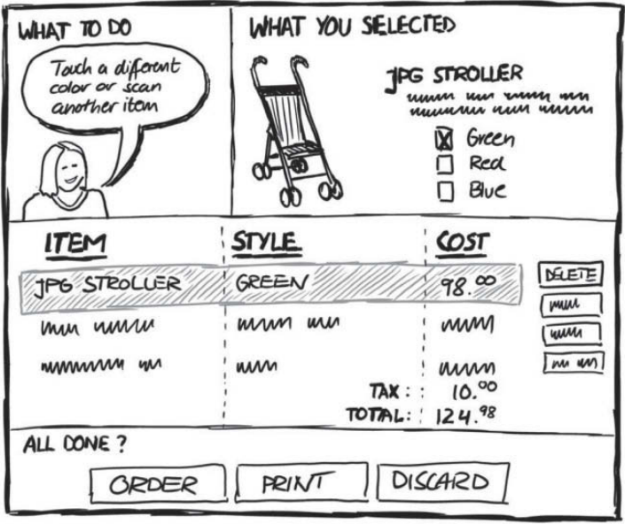
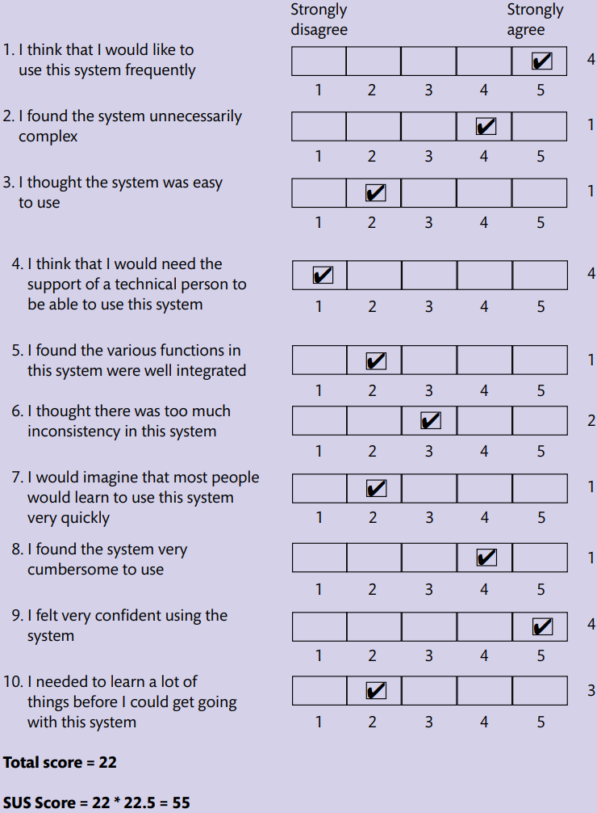

# Design and Evaluation of User Interfaces

## Envisionment

Envisionment is concerned with making ideas visible; with 
externalizing thoughts. Externalization can take all manner of forms: 
stories and scenarios, presentations, sketches, formal models, software 
prototypes, cardboard models and so on. Different forms of 
representation will be more or less useful at different stages in the 
design process and more or less effective for doing different things. A 
formal presentation of a design concept for a potential client will look 
quite different from a sketch of a screen layout intended to explore 
what something will look like. Envisionment is needed to represent 
design work to ourselves and to others. It occurs throughout 
development as the designer generates multiple design solutions and 
whittles them down to a final product or service.

After studying this lecture you should be able to:

* Use a variety of techniques for envisioning design problems and 
possible solutions
* Understand the role of concrete scenarios in envisioning design
* Select and use appropriate prototyping techniques
* Understand the main factors in communicating designs effectively

Envisionment is fundamental to effective human-centred design, to enable designers 
to see things from other people’s perspectives and to explore design concepts and ideas 
with others. Different representations of design ideas are useful at different stages for different people. They help with generation, communication and evaluation of ideas. A sketch ‘on the back of an envelope’ might be useful for generating an idea and expressing it to a colleague – but it is not so good for giving to a client

### An outline envisionment process

Here is a suggested series of steps for the envisionment process, pulling together the 
wide-ranging material in this lecture.

1. Review the design brief, any constraints and requirements and conceptual scenarios. 
2. Develop representations of your design ideas. This is the process of ideation. 
Sketching is central to the process. The aim is to generate many ideas to explore the 
spaces of possible experiences (this lecture). 
3. If your service or product is a new one, experiment with different metaphors and 
design concepts through your representations (in the design part, of the next lecture). 
4. Develop the ‘look and feel’ of the service or product, sketch out the touchpoints, 
channels of interaction and navigational structure of the whole UX (this chapter). 
5. Explore design ideas with the people who will be using the system wherever possible 
(using techniques described in the previous lecture). 
6. Develop wireframes to provide more detail on the proposed structure and navigation 
(this chapter). 
7. Iterate and gradually formalize the design (making it more concrete) through prototypes and further evaluations ( Lecture 7)

### Sketching for ideation

Envisionment is about bringing abstract ideas to life.

Bill Buxton, a UX designer at Microsoft, has promoted the importance of sketching in 
his book Sketching User Experiences

Buxton argues that

* sketches are quick, timely, inexpensive, disposable and plentiful. The UX designer should be happy to throw away sketches and so not get too committed to particular design features. 
Buxton continues by identifying that 
* sketches need a clear vocabulary, have ‘distinct gesture’ (fluidity), minimal detail and an appropriate degree of refinement. 
 Buxton’s final considerations for sketches are that 
* they should suggest and explore rather than confirm and provide some ambiguity. Sketches are there to encourage people to question and to fill in the gaps. The following figure shows an example of a sketch for the interface to an interactive shopping service. Greenberg et al . (2012) emphasize that in addition to the elements shown in the figure, sketches can include annotations, arrows 
(to show movement or to highlight particular areas of the sketch) and notes about issues 
that the designer has yet to resolve.

Storyboarding is a technique taken from filmmaking – using a simple cartoon-like structure, key moments from the interactive experience are represented. The advantage of storyboarding is that it allows you to get a feel for the ‘flow’ of an experience. It is also a very economical way of representing the design – a single page can hold 6–8 ‘scenes’. It is often helpful to sketch out a storyboard based around a concrete scenario. The two together are very helpful in working through design ideas with customers.

Three main types of storyboarding are commonly found in UX design:

* Traditional storyboarding. A storyboard for a film would usually have some notes 
attached to each scene expanding on what will happen – this helps overcome the 
limitations of representing a dynamic experience in a static medium. In UX design, 
notes below each sketch usually contain the relevant steps from a scenario, and the 
sketches themselves. 
* Scored storyboards. If the application has a lot of motion graphics the storyboard can 
be annotated – a sketch is annotated with appropriate notation and notes about, for 
example, type, colours, images, sound and other issues are attached underneath. 
* Text-only storyboards. These are useful if the application has a lot of complex 
sequences. You can specify what images appear, what text accompanies them, any 
accompanying media, general notes about tone, flow, etc.

### Visualizing look and feel

Designers need ways to envision the various touchpoints, service moments and user journeys so that they can establish a common ‘look and feel’ for the whole UX. The look (how things are represented) and feel (how things behave) should have some consistency across the different channels and should reflect the overall brand that the UX is aiming to establish

Designers should aim to evoke particular meanings in their users. They should aim to bring about those key aspects of experience design – identity, adaptivity, narrative, immersion and flow – along with the characteristics of evoking the different 
types of pleasure and characteristics of product attachment. Designers need to establish the aesthetics of the product or service they are developing. To do this, designers need to find some way to envision the feelings and sense of 
presence that users will have when they experience a service or product.

### Mood boards

Mood boards are widely used in advertising and interior design. Quite simply designers gather visual stimuli that capture something of the feeling about the design. Photographs and other images, colours, textures, shapes, headlines from newspapers or magazines, quotations from people, pieces of fabric can all be used to contribute to this.

Lucero (2012) argues that mood boards are useful for ‘framing, aligning, paradoxing, abstracting, and directing’ designers in their work on the look and feel of a product or service.

The rule with mood boards is that ‘anything goes’. The point of the board is not to 
formally represent some aspect of the design but simply to act as inspiration – perhaps 
promoting a particular line of thought, or providing inspiration for a colour scheme. 
One technique is to get the client to create a mood board. This can give you an insight 
into the kinds of aesthetics that are likely to appeal to them.

### Descriptive adjectives

As a variation on the mood board concept, writing down adjectives that describe some aspect of the system can be useful. You can envision the look of a service by writing down what emotions you want it to evoke in the users. For example, you want users to feel that this is a serious app, providing content that has been well researched and well written but that retains some sense of adventure and intrigue. Listing descriptive adjectives for a project will lead to a set of semantic scales that subsequently can be used for evaluation through semantic differentials.

## Lecture Four - Physical Design - General guidelines and widgets

### SUS  - A quick and dirty usability scale

The System Usability Scale (SUS) is a simple, ten-item scale giving a global view of subjective assessments of usability.  
SUS is a Likert scale . It is often assumed that a Likert scale is simply one based on 
forced-choice questions, where a statement is made and the respondent then indicates 
the degree of agreement or disagreement with the statement on a 5 (or 7) point scale.

####  Using SUS

The SU scale is generally used after the respondent has had an opportunity to use the 
system being evaluated, but before any debriefing or discussion takes place. 
Respondents should be asked to record their immediate response to each item, rather 
than thinking about items for a long time.  
All items should be checked. If a respondent feels that they cannot respond to a 
particular item, they should mark the centre point of the scale.

#### Scoring SUS

SUS yields a single number representing a composite measure of the overall usability 
of the system being studied. Note that scores for individual items are not meaningful 
on their own. 
To calculate the SUS score, first sum the score contributions from each item. Each 
item’s score contribution will range from 0 to 4. For items 1, 3, 5, 7 and 9 the score 
contribution is the scale position minus 1. For items 2, 4, 6, 8 and 10, the contribution 
is 5 minus the scale position. Multiply the sum of the scores by 2.5 to obtain the overall value of SU.  
**SUS scores have a range of 0 to 100.**  
**The following section gives an example of a scored SU scale.**

### Principles

For ease of memorizing and use we have grouped them into three main categories – 
learnability, effectiveness and accommodation – but these groupings are not rigid. 
Systems should be learnable, effective and accommodating.

Principles 1–4 are concerned with access, ease of learning and remembering (learnability).  
Principles 5–7 are concerned with ease of use, and principles 8 and 9 with safety (effectiveness).  
Principles 10–12 are concerned with accommodating differences between people and respecting those differences (accommodation). 
Designing user experience from a human-centred perspective is concerned with the following.

Helping people access, learn and remember the system

1 *Visibility*. Try to ensure that things are visible so that people can see what functions are available and what the system is currently doing. This is an important part of the psychological principle that it is easier to recognize things than to have to recall them. If it is not possible to make it visible, make it observable. Consider making things ‘visible’ through the use of sound and touch.  
2 *Consistency*. Be consistent in the use of language and design features and be consistent with similar systems and standard ways of working. Consistency can be something of a slippery concept (see the Further thoughts box). Both conceptual and physical consistency are important. 
3 *Familiarity*. Use language and symbols that the intended audience will be familiar with. Where this is not possible because the concepts are quite different from those people know about, provide a suitable metaphor to help them transfer similar and related knowledge from a more familiar domain. 
4 *Affordance*. Design things so it is clear what they are for – for example, make buttons look like push buttons so people will press them. Affordance refers to the properties that things have (or are perceived to have) and how these relate to how the things could be used. Buttons afford pressing, chairs afford sitting on, and Post-it Notes afford writing a message on and sticking next to something else. Affordances are culturally determined. 

*Giving them the sense of being in control, knowing what to do and how to do it* 
5 *Navigation*. Provide support to enable people to move around the parts of the system: maps directional signs and information signs. 
6 *Control*. Make it clear who or what is in control and allow people to take control. Control is enhanced if there is a clear, logical mapping between controls and the effect that they have. Also make clear the relationship between what the system does and what will happen in the world outside the system. 
7 *Feedback*. Rapidly feed back information from the system to people so that they 
know what effect their actions have had. Constant and consistent feedback will 
enhance the feeling of control.  
*Safely and securely* 
8 *Recovery*. Enable recovery from actions, particularly mistakes and errors, quickly and effectively. 
9 *Constraints*. Provide constraints so that people do not try to do things that are inappropriate. In particular, people should be prevented from making serious errors through properly constraining allowable actions and seeking confirmation of dangerous operations. 

*In a way that suits them* 
10 *Flexibility*. Allow multiple ways of doing things so as to accommodate people with different levels of experience and interest in the system. Provide people with the opportunity to change the way things look or behave so that they can personalize the system. 
11 *Style*. Designs should be stylish and attractive. 
12 *Conviviality*. Interactive systems should be polite, friendly and generally pleasant. Nothing ruins the experience of using an interactive system more than an aggressive message or an abrupt interruption. Design for politeness
Conviviality also suggests joining in and using interactive technologies to connect 
and support people.

### Dark Patterns

Besides these guidelines for developing good designs, we should acknowledge that 
there are interaction patterns aimed at duping users, or aimed at getting them to do 
things that they did not intend to do. These so-called dark patterns aim to get users to 
sign up to full-price services, post items on their social media, frighten users into making some choice or do a host of other things. There is a comprehensive list at [www.darkpatterns.org](www.darkpatterns.org)

### Summary

Good design is about usability. It is about ensuring that systems are accessible to all and 
that designs are acceptable for the people and contexts in which they will be used. 
Designers need to evaluate their designs with people and involve people in the design 
process. Paying attention to design principles can help sensitize the designer to key 
aspects of good design.

* Access to interactive systems for all people is an important right. 
* Usability is concerned with balancing the PACT elements in a domain. 
* Acceptability is concerned with ensuring that designs are appropriate to contexts of use. 
* Twelve design principles are particularly important. They can be grouped into three 
main design issues of learnability, effectiveness and accommodation.

## Lecture Five

After this lecture you should be able to:

* Describe the importance of memory and attention and their major 
components and processes
* Understand attention and awareness; situation awareness, 
attracting and holding attention
* Understand the characteristics of human error and mental 
workload and how they are measured.