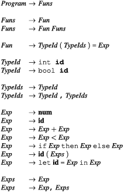

# Languages and Compilers

## Lecture 2 - Lexical analysis: Regular expressions and automata

The learning goals are:

* To be able to explain the rôle of lexical analysis in the implementation of a programming language
* To be able to use the basic terminology for lexical analysis correctly
* To be able to write a correct regular expression that specifies a given language
* To be able to construct an equivalent NFA from a regular expression
* To be able to explain the method used for constructing an NFA from a regular expression

Reading: Introduction to Compiler Design:  Sections 1.1 to 1.3

### Regular Expressions (You probably know most of this)

The set of all integer constants or the set of all variable names are examples of sets of strings, where the individual digits or letters used to form these constants or names are taken from a particular alphabet, i.e., a set of characters. A set of strings is called a language. For integers, the alphabet consists of the digits 0–9 and for variable names, the alphabet contains both letters and digits (and perhaps a few other characters, such as hyphens and underscores).
Given an alphabet, we will describe sets of strings over this alphabet by regular expressions, an algebraic notation that is compact and relatively easy for humans to use and understand. The idea is that regular expressions that describe simple sets of strings can be combined to form bigger regular expressions that describe more complex sets of strings. Regular expressions are often called “regexps” or "Regex" for short.

When talking about regular expressions, we will use the letters *r*, *s* and *t* in italics to denote unspecified regular expressions. When letters stand for themselves (i.e., in 
regular expressions that describe strings that use these letters) we will use typewriter font, e.g., **a** or **b**. The letters *u*, *v* and *w* in italics will be used to denote unspecified single strings, i.e., members of some language. As an example, **abw** denotes any string starting with ab. When we say, e.g., “The regular expression **s**” (note the 
typewriter font) we mean the regular expression that describes a single one-letter string “**s**”, but when we say “The regular expression **s**” (note the italics), we mean a 
regular expression of any form which we just happen to call **s**. We use the notation L(**s**) to denote the language (i.e., set of strings) described by the regular expression 
**s**. For example, L(**a**) is the set {“**a**”}.

To find L(**s**) for a given regular expression *s* ,we use derivation: Rules that rewrite a regular expression into a string of letters. These rules allow a single regular expression to be rewritten into several different strings, so .L(s) is the set of strings that s can be rewritten to using these rules. L(s) is often an infinite set, but each string in the set is finite and can be obtained by a finite number of derivation steps. Figure 1.1 shows the different forms of regular expression, the derivation rules for these, and an informal description of what the regular expression forms mean. 
Note that we use a double arrow (⇒) to denote derivation. In addition to the specific derivation rules in Fig. 1.1, we also use some general rules to make derivation reflexive and transitive:

*s* ⇒ *s*                  Derivation is reflexive
*r* ⇒ *t* if *r* ⇒ *s* and *s* ⇒ *t*  Derivation is transitive

Note that, while we use the same notation for concrete strings and regular expressions denoting one-string languages, the context will make it clear which is meant. We will often show strings and sets of strings without using quotation marks, e.g., write {**a**, **bb**} instead of {“a”, “bb”}. When doing so, we sometimes use. ε to denote the empty string, so the derivation *s*∗ ⇒ shown in Fig. 1.1 can also be written as. *s*∗ ⇒ *ε*.
We can use the derivation rules to find the language for a regular expression. As an example, .*L*(**a**(**b**|**c**)) = {**ab**, **ac**} because **a**(**b**|**c**) ⇒ **a**(**b**) = **ab** and **a**(**b**|**c**) ⇒ **a**(**c**) = **ac**. **L**((**a**|**b**)∗)is infinite and contains any sequence of **a**s and **b**s, including the empty sequence. For example, the string **ab** is in *L*((**a**|**b**)∗) because (**a**|**b**)∗ ⇒ (**a**|**b**)(**a**|**b**)∗ ⇒ **a**(**a**|**b**)∗ ⇒ **a**(**a**|**b**)(**a**|**b**)∗ ⇒ **ab**(**a**|**b**)∗ ⇒ **ab**.

Parentheses and Precedence Rules

When we use the symbols above to construct composite regular expressions such as **a**|**ab**∗, it is not a priori clear how the different subexpressions are grouped. We 
will sometimes (like we did above) use parentheses to make the grouping of symbols explicit such as in (**a**|(**ab**))∗. Additionally, we use precedence rules, similar to the 
algebraic convention that multiplication binds stronger than additions, so. 3+4×5 is equivalent to 3+(4×5) and not (3+4)×5. For regular expressions, we use the following conventions: ∗ binds tighter than concatenation, which binds tighter than alternative (|). The example **a**|**ab**∗ from above is, hence, equivalent to **a**|(**a**(**b**∗)). The | operator is associative and commutative. Concatenation is associative (but obviously not commutative) and distributes over |. Figure 1.2 shows these and other algebraic properties of regular expressions, including properties of some of the shorthands introduced below.

#### Shorthands

While the constructions in Fig. 1.1 suffice to describe e.g., number strings and variable names, we will often use extra shorthands for convenience. For example, if we want 
to describe non-negative integer constants, we can do so by saying that a number constant is a sequence of one or more digits, which is expressed by the regular expression

(**0**|**1**|**2**|**3**|**4**|**5**|**6**|**7**|**8**|**9**)(**0**|**1**|**2**|**3**|**4**|**5**|**6**|**7**|**8**|**9**)∗
The large number of different digits makes this expression rather verbose. It gets even worse when we get to variable names, where we must enumerate all alphabetic letters (in both upper and lower case). 
Hence, we introduce a shorthand for sets of letters. A sequence of letters enclosed in square brackets represents the set of these letters. For example, we use [ab01] 
as a shorthand for. **a**|**b**|**0**|**1**. Additionally, we can use interval notation to abbreviate [**0123456789**] to [**0–9**]. We can combine several intervals within one bracket and for example write [**a–zA–Z**] to denote all alphabetic letters in both lower and upper case. 
When using intervals, we must be aware of the ordering for the symbols involved. For the digits and letters used above, there is usually no confusion. However, if we write, e.g., [**0–z**] it is not immediately clear what is meant. When using such notation in lexer generators, a character set encoding such as ASCII, ISO 8859-1, or UTF-8 is 
usually implied, so the symbols are ordered as defined by these encodings. To avoid confusion, we will in this book use the interval notation only for intervals of digits 
or alphabetic letters. 
Getting back to the example of integer constants above, we can now write this much shorter as [**0–9**][**0–9**]∗. 
Since s∗ denotes *zero or more* occurrences of s, we needed to write the set of digits twice to describe that *one or more* digits are required. Such non-zero repetition is quite 
common, so we introduce another shorthand,. s+, to denote one or more occurrences of. s. With this notation, we can abbreviate our description of integers to [0–9]+. 
On a similar note, it is common that we can have zero or one occurrence of something (e.g., an optional sign to a number). Hence we introduce the shorthand **s**? for **s**|**ε**. 
The shorthand symbols. + and. ? bind with the same precedence as∗.

Examples of this can be found in: "1.1.2 Examples" in the book "Introduction to Compiler Design"

### Nondeterministic Finite Automata

A finite automaton is, in the abstract sense, a machine that has a finite number of states and a finite number of transitions between pairs of states. A transition between 
two states is usually labelled by a character from the input alphabet, but we will also use transitions marked with. ε, the so-called epsilon transitions.
A finite automaton can be used to decide if an input string is a member in some particular set of strings. To do this, we select one of the states of the automaton as the starting state. We start in this state, and in each step we can do one of the following:

* Follow an epsilon transition to another state, or 
* Read a character from the input and follow a transition labelled by that character.

**Definition 1.1** A *nondeterministic finite automaton* consists of a set S of states. One of these states, *s_0 ∈ S*, is called the *starting state* of the automaton, and a subset 
*F ⊆ S* of the states are *accepting states*. Additionally, we have a set *T* of **transitions**. Each transition *t* connects a pair of states *s_1* and *s_2* and is labelled with a symbol, which is either a character *c* from an alphabet *Σ*, or the symbol *ε*, which indicates an *epsilon-transition*. A transition from state *s* to state *t* on the symbol *c* is written as *s^c_t*. 
Starting states are sometimes called *initial states* and accepting states can also be called *final states* (which is why we use the letter *F* to denote the set of accepting states)
We use the abbreviations FA for finite automaton, NFA for nondeterministic finite automaton and DFA for deterministic finite automaton.

### Converting a Regular Expression to an NFA

We will construct an NFA compositionally from a regular expression, i.e., we will construct the NFA for a composite regular expression from the NFAs constructed from its subexpressions. To be precise, we will from each subexpression construct an NFA fragment and then combine these fragments into bigger fragments. A fragment is not a complete 
NFA, so we complete the construction by adding the necessary components to make a complete NFA. 
An NFA fragment consists of a number of states with transitions between these and additionally two incomplete transitions: One pointing into the fragment and one pointing out of the fragment. The incoming half-transition is not labelled by a symbol, but the outgoing half-transition is labelled by either. ε or an alphabet symbol. These half-transitions are the entry and exit to the fragment and are used to connect it to other fragments or additional “glue” states.

Construction of NFA fragments for regular expressions is shown in Fig. 1.4. The construction follows the structure of the regular expression by first making NFA 
fragments for the subexpressions, and then joining these to form an NFA fragment for the whole regular expression. The NFA fragments for the subexpressions are shown as dotted ovals with the incoming half-transition on the left and the outgoing half-transition on the right. The symbol on the outgoing half-transition is not shown 
when an NFA fragment is shown as a dotted oval (it is “hidden” inside the oval). 
When an NFA fragment has been constructed for the whole regular expression, the construction is completed by connecting the outgoing half-transition to an accepting 
state. The incoming half-transition serves to identify the starting state of the completed NFA. Note that, even though we allow an NFA to have several accepting states, an NFA constructed using this method will have only one: the one added at the end of the construction. 
An NFA constructed this way for the regular expression (**a**|**b**)∗**ac** is shown in Fig. 1.5. The states are numbered for future reference.

## Lecture 6 -
The learning goals are
To be able to give a precise explanation of the notions of binding and bound occurrences and free variables
To be able to give a precise explanation of the notions of static and dynamic scope rules
To be able to reason about program behaviour under notions of static and dynamic scope rules
To be able to give a precise account of the notion of a binding model and how environments relate to symbol tables
To be able to explain the important operations om symbol tables
To be able to describe and carry out the main steps of an interpreter

After lexing and parsing, we have the abstract syntax tree of a program as a data structure in memory. But a program needs to be executed, and we have not yet dealt with that issue. 
The simplest way to execute a program is interpretation. Interpretation is done by a program called an interpreter, which takes the abstract syntax tree of a program and executes it by inspecting the syntax tree to see what needs to be done. This is similar to how a human evaluates a mathematical expression: We insert the values of variables in the expression and evaluate it bit by bit, starting with the innermost parentheses and moving out until we have the result of the expression. We can then repeat the process with other values for the variables. 
There are some differences, however. Where a human being will copy the text of the formula with variables replaced by values, and then write a sequence of more and more reduced copies of a formula until it is reduced to a single value, an interpreter will keep the formula (or, rather, the abstract syntax tree of an expression) unchanged and use a symbol table to keep track of the values of variables. Instead of reducing a formula, the interpreter is a function that takes an abstract syntax tree and a symbol table as arguments and returns the value of the expression represented by the abstract syntax tree. The function can call itself recursively on parts of the abstract syntax tree to find the values of subexpressions, and when it evaluates a variable, it can look its value up in the symbol table. 
This process can be extended to also handle statements and declarations, but the basic idea is the same: A function takes the abstract syntax tree of the program and, possibly, some extra information about the context (such as a symbol table or the input to the program) and returns the output of the program. Some input and output may be done as side effects by the interpreter.
We will in this chapter assume that the symbol tables are persistent, so no explicit action is required to restore the symbol table for the outer scope when exiting an inner scope. In the main text of the chapter, we don’t need to preserve symbol tables for inner scopes once these are exited (so a stack-like behaviour is fine), but in one of the exercises we will need symbol tables to persist after their scope is exited.

### The Structure of an Interpreter 
An interpreter will typically consist of one function per syntactic category. Each function will take as arguments an abstract syntax tree from the syntactic category 
and, possibly, extra arguments such as symbol tables. Each function will return one or more results, which can be the value of an expression, an updated symbol table, 
or nothing at all (relying on side effects to, e.g., symbol tables). These functions can be implemented in any programming language for which we already have an implementation. This implementation can also be an interpreter, or it can be a compiler that compiles to some other language. Eventually, we will need to either have an interpreter written in machine language or a compiler that compiles to machine language. For the moment, we just write interpretation functions in a notation reminiscent of a high-level programming language and assume an implementation of this exists. Additionally, we want to avoid being specific about how abstract syntax is represented, so we will use a notation that looks like concrete syntax to represent abstract syntax.

### A Small Example Language 
We will use a small (somewhat contrived) language to show the principles of interpretation. The language is a first-order functional language with recursive definitions. 
The syntax is given in Grammar 4.1. The shown grammar is clearly ambiguous, but we assume that any ambiguities have been resolved during parsing, so we have an unambiguous abstract syntax tree. 
In the example language, a program is a list of function declarations. The functions are all mutually recursive, and no function may be declared more than once. Each function declares its result type and the types and names of its arguments. Types are `int` (integer) and `bool` (Boolean). There may not be repetitions in the list of parameters for a function. Functions and variables have separate name spaces. The body of a function is an expression, which may be an integer constant, a variable name, a sum-expression, a comparison, a conditional, a function call or an expression with a local declaration. Comparison is defined both on booleans (where ***false*** is considered smaller than ***true***) and integers, but addition is defined only on integers.

A program must contain a function called main, which has one integer argument and which returns an integer. Execution of the program is by calling this function 
with the input (which must be an integer). The result of this function call (also an integer) is the output of the program.

### An Interpreter for the Example Language 
An interpreter for this language must take the abstract syntax tree of the program and an integer (the input to the program) and return another integer (the output of the program). Since values can be both integers or booleans, the interpreter uses a value type that contains both integers and booleans (and enough information to tell them apart). We will not go into detail about how such a type can be defined but simply assume that there are operations for testing if a value is a boolean or an integer and operating on values known to be integers or booleans. If we during interpretation find that we are about to, say, add a boolean to an integer, we stop the interpretation with an error message. We do this by letting the interpreter call a function called error(). 
We will start by showing how we can evaluate (interpret) expressions, and then extend this to handle the whole program.

**Evaluating Expressions**
When we evaluate expressions, we need, in addition to the abstract syntax tree of the expression, also a symbol table `vtable` that binds variables to their values. Addi
tionally, we need to be able to handle function calls, so we also need a symbol table `ftable` that binds function names to the abstract syntax trees of their declarations. The 
result of evaluating an expression is the value of the expression. 
For terminals (variable names and numeric constants) with attributes, we assume that there are predefined functions for extracting these attributes. Hence, **id** has an 
associated function `getname`, that extracts the name of the identifier. Similarly, **num** has a function `getvalue`, that returns the value of the number. 
Figure 4.2 shows a function *Eval_Exp*, that takes an expression *Exp* and symbol tables `vtable` and `ftable`, and returns a value, which may be either an integer or a boolean. Also shown is a function *Eval_Exps*, that evaluates a list of expressions to a list of values. We also use a function `Call_Fun` that handles function calls. We will define this later.
The main part of *Eval_Exp* is a case-expression (in some languages called ``switch`` or ``match``) that identifies which kind of expression the top node of the abstract 
syntax tree represents. The patterns are shown as concrete syntax, but you should think of it as pattern matching on the abstract syntax. The column to the right of 
the patterns shows the actions needed to evaluate the expressions. These actions can refer to parts of the pattern on the left. An action is a sequence of definitions of local 
variables followed by an expression (in the interpreter) that evaluates to the result of the expression that was given (in abstract syntax) as argument to *Eval_Exp*. 
We will briefly explain each of the cases handled by *Eval_Exp*

 The value of a number is found as the .value attribute to the node in the abstract 
syntax tree. 
• The value of a variable is found by looking its name up in the symbol table for 
variables. If the variable is not found in the symbol table, the lookup-function 
returns the special value.unbound. When this happens, an error is reported and the 
interpretation stops. Otherwise, it returns the value returned by lookup. 
• At a plus-expression, both arguments are evaluated, then it is checked that they 
are both integers. If they are, we return the sum of the two values. Otherwise, we 
report an error (and stop). 
• Comparison requires that the arguments have the same type. If that is the case, we 
compare the values, otherwise we report an error. 
• In a conditional expression, the condition must be a boolean. If it is, we check if it 
is true. If so, we evaluate the then-branch, otherwise, we evaluate the else-branch. 
If the condition is not a boolean, we report an error. 
• At a function call, the function name is looked up in the function environment 
to find its definition. If the function is not found in the environment, we report 
an error. Otherwise, we evaluate the arguments by calling .EvalExps and then call 
.CallFun to find the result of the call

Thursday 14 March 2024 – Scopes; Interpretation
The text is chapters 4 and 5 of Introduction to Compiler Design.
