# Systems Development/System Analysis and Design

This class, has a lot of sections where everything in it seems important to me, sometime just for some context. Therefore, this class will probably just have a lot of what seems like copy pasting instead of just 'this one sentence seems important' kind of notes.

Sections marked with red are extremly important for this subject, and should therefore be read and understood.

# Lecture one

## Method

### Objects and Classes

In OOA&D, the basic building block is an object. During analysis, we use 
objects to organize our understanding of the system's context. During design, we use objects to understand and describe the system itself. In each 
case, the definition is the same:

***Object:*** *An entity with identity, state, and behavior.*

In analysis, an object is an abstraction of a phenomenon in the system's context, such as a customer. The object expresses the users' view of reality: Certain people are customers, and they are treated as single entities with a specific identity, state, and behavior. In design, an object is part of the system. A customer can also be a design object. In design, the customer object would represent parts of a specific person's history and state within the system and make operations available for oth er system objects.

Typically, we describe objects in terms of classes, rather than individually. For example, a system's customer class might contain specific customer objects, such as the user's mother or neighbor, but the same class will also contain many other customers, each with their unique identity, state, and behavior. Classes are useful for understanding objects and vitally important for describing them. Instead of describing each particular object, we develop a shared object description for all objects in the same class.

***Class:*** *A description of a collection of objects sharing structure, behavioral pattern, and attributes.*

### Analysis and Design Objects

Analysis and design often share objects and classes, although the object's meaning changes. 
An analysis object's identity expresses how the user differentiates it from the other objects in the context. 
A design object's identity expresses how other objects in the system can recognize it, and thereby gain access to it. Design also gives rise to new classes. Such classes do not reflect the system's context, but they are important for implementing the system on the technical platform.

Object behavior is the decisive difference between analysis and design objects. In analysis, we express an object's behavior by the events it performs or experiences. Customer objects are, for example, involved in ordering and shipping goods. Such events (order and ship) occur at definite points in time, and involve one or more classes of objects (customers and goods). The events help us understand how and when to change a system's representation of an object.

In design, we express an object's behavior by the operations it can carry out and make available to other objects in the system. Customer objects, for example, can represent information about real-world customers. Such objects have operations, such as "add order'' and "remove order," which let the system update the customer object's state as the real world changes. A design object encapsulates the internal representation of its state. The representation is hidden so other objects can only access the object's state (which 
goods are ordered) through its operations (add order and remove order) An operation is defined as a process capability in a class and activated through the class' objects.

Analysis and design objects describe two clearly different matters. 
Analysis objects describe phenomena outside the system, such as people and things, which are typically independent. Although we cannot always command them, we must register the events they perform or experience. 
Design objects describe phenomena within the system that we can control. We describe their behavior as operations for the computer to carry out

### Advantages of Object-Orientation

Objects, state, and behavior, are more general concepts and are suitable for describing most phenomena that can be expressed in natural language. Objects are similar to nouns, designating things such as people or inventory. Object attributes or states, like adjectives, characterize object traits. Object behavior, like verbs, describe actions or influences
For example:
"The house looked nice after Bob painted it." This closely parallels the object-oriented way of thinking. 
There are two objects (the house and Bob), a common event (painting the house), and one of the objects has changed state (the house has become nice)

Here we touch upon a primary strength of object-orientation: It provides clear information about the system's context.Good at distributing specialized data throughout a system.

Another strength of object-oriented methods is the close connection between object-oriented analysis, object-oriented design, object-oriented user interfaces, and object-oriented programming. Objects can model social, economic, and organizational conditions, as well as the system's interfaces, functions, processes, and components.

And lastly; Objects provide material coherence to the system's structure. They also provide mental coherence: Objects offer developers a natural way of thinking about problems that support abstraction without forcing a one-sided, technical point of view.

### Model the Context.

Success in system development greatly depends on the developer's understanding of the system's practical application. As the figure below shows, the system's context can be viewed from two complementary perspectives: the system models something (the problem domain) and it is operated by users (the application domain).

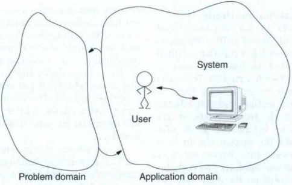

We define these two different, but strongly related context perspectives as follows:

***Problem domain:*** *That part of a context that is administrated, monitored or controlled by a system.*

***Application domain:*** *The organization that administrates, monitors, or controls a problem domain.*

The problem domain describes the system's purpose, as well as the parts of reality that the system should help administrate, monitor, or control. The application domain is a part of the user organization. A system's success (or failure) depends on how well it links the application and problem domains together into a functioning whole.

A few examples of the problem domain and application domain would be:
For a payroll system, the application domain includes the personnel office, while the problem domain includes the employees, their contracts, and 
their work schedules. 
For an air traffic control system, the application domain is a part of the air traffic controllers' job, while the problem domain includes planes, flight departures, flight corridors, runways, flight positions, and movements. 
For a device for measuring telephone signals, the application domain is part of the technicians' job, and the problem domain includes signals, protocols, lines, transmitters, and receivers.

A key task in analysis and design is to model what the system will administrate, monitor, or control. For example, in an air traffic control system, this includes airplanes, flight departures, flight corridors, and positions. The air traffic controllers' job consists of monitoring and controlling the air traffic using the system's information about these objects. Controllers use this information, rather than direct observation of aircraft movement, as a basis for decision making. Their understanding of air traffic consists of both the actual situation in the air, and the way they think and talk about the traffic in technical terms. 
Because the controllers' understanding of the problem domain is both created and maintained through the system, the problem domain and the system's model of the problem domain must agree completely. This is a crucial quality requirement. It is also crucial that the system's model is organized in agreement with the air traffic controller's structural understanding. Thus, in this and all cases, system developers should analyze the problem domain, both to understand the system's context and to learn how to 
usefully representing it to the system's users. 
A second key task in analysis and design is to model how the system will interact with users in the application domain. This includes identifying all user groups and understanding both what they will use the system for and how each group will interact with the system in different situations. 
If we continue with the air traffic control example,  we would study how traffic controllers, pilots, and ground personnel would interact with the system to ensure a smooth and effective operation once the system is deployed.

### Emphasize the Architecture

Understanding the context is important, but it is equally important to understand the system itself. We view the system as an entity adapted to solve identified needs for a specific technical platform:
***System:*** *A collection of components that implement modeling requirements, functions, and interfaces.*

During analysis and design, it is essential to develop an overall understanding of the system. OOA&D therefore emphasizes the system architecture as a key challenge, focusing on ease of understanding, flexibility, and usefulness. 
The system architecture should be easy to understand because it serves as the basis for decisions and as a communication and work tool in the development work ahead. It should be 
flexible because system development takes place in a turbulent environment. Finally, the architecture sh ould be useful because the system's success depends on the role it will play in the user organization. 
However, these general criteria do not specify when a design job is finished. The main purpose of OOA&D is to design a system without significant uncertainties.

A reasonable architecture gives us an overview of the system. Even small systems contain so many classes and objects that the system easily becomes unwieldy. As a tool for handling system complexity, OOA&D uses components, which are groups of classes and objects.  
Identifying the relevant components in a concrete system is a crucial issue in object-oriented design. The choice of architecture will always reflect the concrete situation, and selecting one is a highly iterative process. In OOA&D, we start with a very basic architecture with three components: a model component, a function component, and an interface component.

### Reuse Patterns

A fundamental way of ensuring quality and efficiency in analysis and design is to reuse ideas that have been tested and used in other situations. OOA&D inspires reuse in two ways: by using objects and components, and, more generally, by using analysis and design patterns. A pattern is a generalized description of a problem and a related solution. 
A pattern is expressed as a configuration of objects or components that can be used as inspiration for analysis and design efforts. A pattern is simplified and abstract, and must 
be adapted to the particulars of a given situation. In essence, it is a template that points at possible, often partial, solutions that must be further developed and supplemented to fit particular needs.

For example, we can use the role pattern during analysis to model different roles that people play over time. Given a system containing information about both employees and customers, we can choose a straightforward model in which people are modeled as employees or customers. However, if a customer is later hired, we would have to model this by having both a customer object and an employee object with similar attributes. 
The alternative is to design a dynamic role model, as shown in the below figure. This is a little more complicated, but better reflects reality. In this model, a person at any point in time has zero or one employee and zero or one customer roles, and maybe several over time. Thus, when a customer is hired, we would simply add an employee role to the existing customer role. The role pattern captures a general way to model objects with dynamically changing roles using a shared repertoire of possible roles.

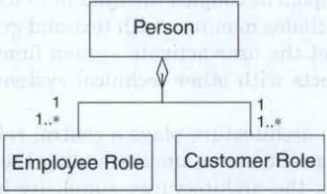

### Tailor the method

OOA&D reflects four central perspectives on a system and its context:

* The system's information contents 
* How the system will be used
* The system as a whole 
* The system's components

The perspectives are connected to OOA&D's main activities:

* Problem-Domain analysis
* Application-Domain analysis
* Architectural design 
* Component design

Each activity leads to specific results, which are subsequently included in the analysis and design documentation. 
How you organize and document these activities will depend on how you tailor OOA&D to the needs of your project.

### Four methods

First understand the system from an information perspective: *The system must offer a useful model of the problem domain.*  
It should contain a model of the relevant problem-domain. This information perspective is predomiant during analysis. But the perspective is also important during design 
since the system should make the model available in an efficient and useful manner.

The system is next understood from the user's viewpoint: The system must be integrated in the application domain. We must understand the people, devices, and other systems that the target system will interact with, and which functions to offer these actors. 
Relations such as how, how quickly, how often, and in what pattern different actors should interact with the system are crucial for system usability. A well-functioning system is integrated with other systems and adapted to the organization and the traditions in the application domain.

The third perspective is the architectural perspective: 
The system must run on a specific technical platform. How should the system be divided into components? Important considerations include the physical processes, units, and connections that make up the technical platform. How should the system use this platform? An architecture emphasis helps you determine how best to take advantage of a platform's possibilities and overcome its limitations.

Finally, the system should be understood as a whole: The system should be a well-functioning unit of cooperating parts. The individual components and their mutual interfaces and interactions should be designed to serve as a basis for system implementation.

### Four Main Activities

OOA&D covers the four perspectives through four main activities, shown in the below figure.

Analysis and design are always strongly iterative, wherein considerations based on one perspective give rise to new considerations based upon another perspective. The four activities' relative importance and sequence changes from project to project. In some projects, the application-domain analysis is characterized by great uncertainty. The project might, for example, be based on a new interface technology that is unfamiliar to both users and developers. 
In other projects, the architecture is characterized by great uncertainty, perhaps because the system is to be implemented on a recently distributed platform. Therefore, the priority and organization of OOA&D's main activities depends on the situation.  

The system should be in balance with its context. But how can you achieve this? The obvious place to start is with the most important perspective. Thus, you must assess the actual situation and decide which perspectives you should emphasize. In practice, an activity's order and importance are controlled by a strategy that reflects the concrete goals and circumstances for analysis and design. How to develop such a strategy for particular projects will be discussed in Lecture 7, or chapter 15 of "Mathiassen, L., Munk-Madsen, A., Nielsen, P. A., & Stage, J. (2000). Object-Oriented Analysis and Design. Marko."
  
OOA&D's four main activities are abstract tasks that you can perform together with other tasks in a practical system development project. How you organize these tasks depends on strategy, which differs from project to project.  
Figure 1.5 shows a traditional, top-down approach based on OOA&D; Figure 1.6 shows a use-case-driven approach, also based on OOA&D. OOA&D offers a systematic and complete approach to object-oriented analysis and design. Principles constitute OOA&D's central and unchangeable parts, while techniques and notation act as their concrete realization. The method was designed so that you can easily adapt it to local traditions. 
and supplement it with elements from other methods;  

### Results

The tangible result of analysis and design is documentation, which helps 
you practically manage the actual analysis and design activities. Documentation provides a reference tool for the developers, and a place to store and organize intermediate results. It also contains agreements between the project participants. Documentation helps create continuity during system development, and thus must be of high quality. At the same time, it should be clear and concise. It requires significant effort to create high quality documentation and an overly detailed design document will not inspire creativity and effectiveness in programmers.  
Whether or not documentation is contained in one document or two is less important in the OOA&D approach. OOA&D produces both an analysis and a design 
document. In Chapter 16, of "Mathiassen, L., Munk-Madsen, A., Nielsen, P. A., & Stage, J. (2000). Object-Oriented Analysis and Design. Marko." a detailed template for each is provided, which you can use as inspiration for designing the documentation for your own projects.

### Unified Process and Notation

OOA&D clearly differ entiates between guidelines for process and those for notation. This separation lets you use the approach regardless of the object-oriented notation you choose. OOA&D also differentiate between general principles and concrete techniques. It's primary emphasis is on principles; OOA&D uses techniques to illustrate how to implement the principles. Classical methods have often given directions that were too detailed and not always valid; they also tend to disregard equally usable alternatives. The advantage of a 
principle-based presentation is that you can substitute your own techniques when the task or terms dictate it. 
 
The choice of UML yields two important advantages. First, UML, like OOA&D, builds on a division between process and notation, so there are no built-in process guidelines in UML to consider. Second, UML's broad support gives you access to a large market of UML-compatible development tools.  
The Unified Software Development Process is related to, but independent of, UML. The unified process represents one way to organize object-oriented projects that is use-case driven, architecture-centric, iterative, and incremental. A use case is a particular technique for application-domain analysis. Lecture 5 Chapter 6, it will be discussed that OOA&D builds on similar, but more general principles.  
Figure 1.6 shows a use-case-driven, architecture-centric, and incremental approach based on OOA&D. As compared with the traditional, top-down approach in figure 1.5, we see differences and similarities.

The traditional approach is driven primarily by problem-domain analysis, whereas the unified approach is driven primarily by application-domain analysis (that is, 
by use cases). The traditional approach emphasizes analysis, design, and programming of the entire system, whereas the unified approach is incremental, focusing on analysis, design, and programming of one system part at a time. Both approaches however are iterative and stress architectural concerns.    

Ultimately, you must identify the uncertainties you face and organize the process accordingly. Sometimes, this will lead you to take a highly incremental approach; other times, a more traditional one. Also, some projects require more focus on application-domain knowledge, while others require an emphasis on the problem domain.

## System Choice

As you might know development projects often begin with a collection of different ideas about the desired system. It might start with a thorough preliminary analysis or with a list of decisions that h ave already been made. It is the system developers' job and responsibility to take a step back and consider the main questions.  
What are the problems we are going to solve? Is the planned system a useful solution? What if we developed an entirely different system?  
In this section, it will be explained how you can take this step back. It will describe how to systematically examine project challenges and options, and 
how to obtain relevant and precise information as a basis for analysis and design. Techniques that can help you create different alternatives are also introduced. These techniques can help your development team thoroughly consider a project situation and arrive at a short and precise definition of the planned system. Although the development team should always analyze, formulate, and evaluate possible solutions, in the end customers and users are responsible for choosing the system.

### System Definition

In order for us developers to design solutions for many of the challenges we will stumple upon during project development we must understand the structures, relations and details of the user organization, and evaluate and manage relevant technologies in a proffesional manner. We should also know how to operate in constantly changing situations with new requirements, ideas and possiblities.
Some development projects arise from problems that needs to be solved, some of these problems, might have been defined and desribed perfectly, while some have just been vaguely identified. So at the begining of development projects we must try to 'find. define and analyse in detail' (see: explicate) the most important challenges in the project. To do so, we explicate can explicate and debate alternative system definitions.
 
**System definition:** *A consicise description of a computerized system expressed in natural language*
 
A system definition expresses funndamental properties for system development and use. It describes the system in context, what information it should contain, which functions it should provide, where it is going to be used, and which conditions the system should be developed under.
   
The intention of such a definition is to explicate different interpretations and possibilities. System definitions help maintain an overview of different options, and you can use them to compare alternatives. When a system defintion has been selected, it should also be used as an indispensable foundation for continuing the analysis and design activities.  

A system definition should be breif, precise, and contain the most fundamental decisions about the system. Creating breif system definitions, provides an overview and makes it easier to compare alternaties. Longs definitions makes this harder.
In this lecture we will also be introduced to the FACTOR criterion for system definitions. Each letter refers to a key element in the system definition.

#### FACTOR

The factor criterion consists of six elements:  
*Functionality:* The system functions that support the application-do-main tasks.  
*Application domain:* Those parts of an organization that administrate, monitor, or control a problem domain.   
*Conditions:* The conditions under which the system will be developed and used.   
*Technology:* Both the technology used to develop the system and the technology on which the system will run.  
*Objects:* The main onbjets in the problem domain.   
*Responsibility:* The system's overall responsibility in relation to its context.
These elements describe, in a coherent manner, the most fundamental decisions involved in creating a sound computerized solution.
The FACTOR criterion can be used in two ways. You can use it to support system-definition development, carefully considering how each of the six elements should be formulated.  Or you can start your definition by describing the system and then use the criteria to see how the system definition satisfies each of the six factors. "In principle either starting point works" -Jan

### Choosing the system

As Figure 2.1 shows, system choice is based on three subactivities.
The first subactivity focuses on challenges: we attempt to get an overview of both the situation and the different ways people interpret it. 
The second subactivity creates and evaluates ideas for system design. This method offers a series of techniques to support creativity and introduce new ways of thinking.  
In the third subactivity, we formulate and choose the system definition, discussing and evaluating alternative system definitions in relation to our particular situation.  

We produce a system definition by iterating through the three subactivities. In this process, an interaction occurs between our situational understanding and the generation of innovative ideas. An idea's relevance is intrinsically tied to the project situation. Conversely, describing the situation typically gives rise to new ideas. The process of composing and choosing system definitions also affects the other subactivities, revealing circumstances that we must closely examine and ideas we must further explore.
   
Choosing which system to develop is a demanding activity. It requires imagination, good ideas, constructive abihties, and a critical sense. To succeed, we must start out from the users' situation and thoroughly understand its challenges. This demands close cooperation with customers and users. Without this foundation, it is difficult to propose relevant solutions. At the same time, we must reflect critically on users' requirements and ideas, particularly if they point toward one specific solution. The users' 
knowledge and experience with computers, the organization's structure, and the existing computerized systems are factors that can complicate a project.

### Describe the Situation

Our understanding of the users' situation must be rich and abundant. To achieve this, we must be open and disposed toward discussion. Thus, we emphasize the following principle:

**Principle:** *Appreciate the situation.*

By working with "rich pictures," we can explicate important user views of a situation, facilitate debate, and get an overview of the situation quickly. The purpose here is to obtain an overview.

### Rich Pictures

A rich picture is an informal drawing that presents the illustrator's understanding of a situation. Figure 2.2 shows an example of a rich picture from a hospital's system development project. The rich picture describes a change from six autonomous wards to a new structure in which the wards become part of a larger unit. The purpose of this organizational change is to improve coordination and resource sharing among the wards.  
A rich picture focuses on important aspects of the situation, which are determined by the illustrator. However, the rich picture should give a broad description of the situation that enables several alternative interpretations. For example, Figure 2.2 shows the increased efficiency that reorganization could bring. It also lets us look at the individual ward: Does it continue to be an efficient entity, or will responsibility become more difficult to assign among the six wards? We can also consider the impact on employees. How will the expected decline in ward-affiliation affect their work?  
Finally, we can focus on changes in managerial forms. The crossed swords in the figure indicate conflicts between the old and new organization, and are relevant in each of the four perspectives.    
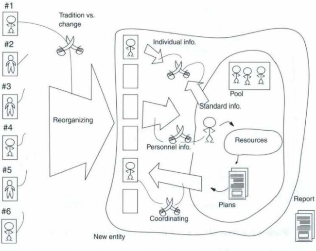 
System development changes are typically not as radical as in the hospital case. Given this, it can be practical to differentiate between rich pictures that focus on stability and those that focus on change. In the former case, a rich picture might describe, in greater detail, a situation that remains stable. An example of this is the way in which an emergency vehicle is dispatched; a rich picture of this is shown in Figure 2.3. The second category describes a transformation between two situations: something exists and something is coming. 
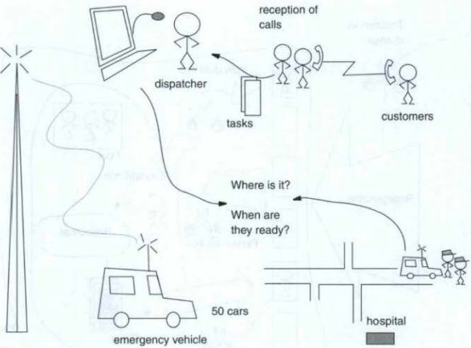 
Coming up with good symbols for drawing rich pictures can be difficult. Figure 2.4 contains some options. The lower part shows symbols you can use to describe things and people; the upper part, symbols you can use for processes and structures. In principle, there are no limits to the types of symbols and icons you can use. The biggest problem for the novice is lack of imagination. Figure 2.4 can be used as inspiration- but the best way to learn how to make rich pictures is to try it and to learn from others. 
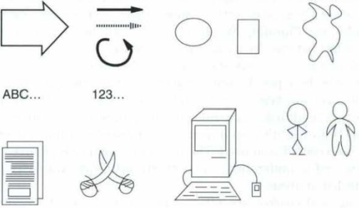

### Practical Advice

To be a useful part of system definition, rich pictures should: 
• contain a lot of information and be open to interpretation;  
• present processes and structures in a coherent, well-balanced way;  
• show at least one problematic area;  
• point at several relevant computerized systems;  
• be rich, but not chaotic;  
• illuminate key aspects of a situation in a way that promotes understanding at many levels 
• avoid representing data and data processing.  
 
Pre-analysis should help create and integrate different ideas for computerized solutions. The rich pictures can thus enable participants to get ideas and bring creativity into the project. Rich pictures should also provide an overview, rather than show too many elements and thus become chaotic. It is better to draw several pictures, especially if the situation is very complex. Finally, it is important to remember that rich pictures are personal.  
The illustrator of the rich picture decides what is relevant to draw. Different viewpoints lead to new pictures. 

### Create ideas

A solid understanding of the existing situation is a good starting point for a development project,. However, it is just as important to bring forth new 
ideas and ways of thinking, which is the second subaclivity in system definition. Good systems ar e created in the tension between tradition and creativity. OOA&D therefore stress the following principle:

**Principle:** *Cultivate new ideas.*

The result of this subactivity is a collection of ideas. The ideas describe parts of a computerized solution that can be summarized in one or more system definitions. The activity of cultivating ideas can only be systematically planned to a certain extent. Many ideas surface because some people are full of ideas. Other ideas come about as a result of coincidence or abstract thinking. We recommend being open to all new ideas. Too often, ideas are discarded without being properly evaluated.  
The goal is to attempt a balance between creating new ideas and reusing well-established ones. New ideas should be cultivated in close cooperation with future users, 
who know both the application domain and their organization's traditions and culture. Without a thorough understanding of the user's context, ideas are likely to be general and abstract.
To generate and evaluate ideas in cooperation with the users, it is suggested to use:  
• exemplars  
• metaphors 
• experiments.   
Exemplars provide a concrete way of creating new ideas. By studying similar systems, you can explore specific ideas that apply to your situation. Metaphors increase your understanding by presenting the user organization in new terms. This can bring entirely different ideas and experiences to the situation. Finally, you can use experiments, in cooperation with users, to assess possible solutions

#### Exemplars

When you develop a new system, OOA&D advises you to look at existing solutions that resemble the one that users desire. If you need a new accounting system, it's a good idea io study an existing system's design and use. You can do this by visiting another organization or by studying standard systems on the market. For every existing solution, try to answer the following questions: 
• Which ideas lay the groundwork for the system? 
• Do the ideas seem useful? Why? 
• Will the ideas work in your context? Why?  
• Can the ideas be adapted to your system? How? 

#### Metaphors

In metaphorical design, we view a user organization or a computerized system through a new lens. For example, we might look at a library system through the lens of an inventory control system. To do so is an easy way to break down habitual thinking. You do not need to develop prototypes or organize visits to other organizations-this is a purely intellectual exercise that you can do at the desk or at a project meeting.  
Metaphors help transfer ideas and experience from other areas. An inventory system typically keeps track of three things: receipt of goods, location of goods, and shipment of goods. How does this relate to a library? By trying to answer this question, you can expand and enrich your understanding of the library system's potential properties.  
OOA&D recommend working with several metaphors. For example, you might view a library as a warehouse, a store, a school, and a meeting place.  
Each of these metaphors will give rise to a richer understanding of the library by emphasizing different features of the library. This will give rise to many different ideas for computer support. The difficult part of metaphorical design is to find the metaphors. Once you find them, we suggest following three simple steps:  

1. Create a long list of aspects related to the metaphor. 
2. Transfer these aspects to your target system. 
3. Determine which of the aspects might be useful.

#### Experiments

An experiment is a planned examination of the target solution's properties. 
The experiment more or less resembles the users' daily work. OOA&D proposes an experiment based on prototypes. The fundamental requirement of the prototype is that it be easy to implement and modify.  
These requirements are easily met with prototypes that are not computer based. For example, you can draw a screen on a piece of paper and use a sequence of screen pictures to illustrate system use. You can draw screen pictures on transparencies and display them. These prototypes can also be supplemented with cardboard boxes representing terminals, printers, and other artifacts. 
One problem with these kind of prototypes is that they do not function on their own; you have to simulate system processes. Thus, if it is technically or economically viable, OOA&D recommends working with computer-based prototypes.

#### Preparation

The purpose of developing a prototype is to test it. You should therefore carefully prepare your tests. To make exploratory experiments realistic, future users should carry them out. A realistic test requires a concrete understanding of, and exhaustive experience with, the work that the prototype is to support. Only potential users have this concrete understanding.  
During prototype preparations, you must make decisions about:  
• cooperation,  
• realism, and  
• selection.  

Determine how users and developers will work together. Your tests can be based on observation, where developers watch while users try out the prototype. Alternatively, you can conduct the test as a discussion between users and developers. Next, you should decide how realistic the test will be. It can be detached from the users' daily work or integrated, so that users actually use the prototype while they work. You can then decide which users should participate and who they represent.

#### Test

The test consists of using the prototype in the chosen surroundings. Once you begin the evaluation, there are very few possibilities to intervene and change the process or the prototype. In many situations, it is difficult to repeat a test. Therefore, you should be sure everything is ready for conducting the test, and for documenting the test.  
For documenting the test the user can write a diary based on themes and subjects, this is great when a developer is the tester, but not as good when it isn't, since 'ordinary' people not always understands what the developers want to learn. It can also be recorded, but it might contain too much irrelevant data.

### Define Systems

The purpose of the third and final subactivity is to choose the actual system 
to develop. You do this by systematically clarifying interpretations, possibilities, and consequences of several alternative solutions. Hence, the following principle: 
  

**Principle:** *Define alternative systems.*
  
The two previous subactivities should give you as many interpretations and 
possibilities as the situation allows, creating an array of new ideas for solutions it can be difficult to maintain an overview of all alternatives and make consistent choices about which ideas to pursue.   
It is recommended precisely summarizing the general properties of potential target systems by formulating the properties into system definitions, which are brief, precise descriptions of solutions expressed in everyday language. 
 
"Systems Are Holistic Views"
A system definition expresses a perspective on something. A single computer application can be viewed in several different ways, depending on how it is used. Designers understand an inventory system in a certain way; they might emphasize, for example, how the system relates to users' jobs. The database administrator might have a third view, emphasizing data and its relation to other parts of the database. 
 
Every system definition represents a specific perception of the real world filtered through the ideas, conceptions, educations, and backgrounds of the people involved. 
A system definition describes a totality, or a whole. It is an overall systems view, which focuses on how all the parts and components interact. A system definition will ther efore express emergent, system-focused properties, rather than detailed, component-oriented properties. User friendliness is an example of an emergent property. It makes sense only when looking at the system as a whole; no part of the system has this property in itself.  
A system definition also reflects specific limitations. We limit some aspects by placing them outside the system, and limit some details by focusing on others.  
Before choosing a system, you should work with several different ones. 
If you consider alternatives and include different interpretations and beliefs, you give everyone involved a fair chance of making a useful choice.  
The quality of the system you finally decide on can then be evaluated relative to the other systems you've considered.  

### Lecture one TL:DR;

A system definition describes a computerized solution in context. Using the 
Conference Planning System, the following definition was formulated:  
**System definition 1:** A computerized system used to prepare and plan an IFIP conference, with emphasis on administration of participants, articles, and the program itself. The system should primarily be an administrative tool, but secondarily serve as a communication medium for the program committee, the organizing committee, and the local administrative personnel to help them manage the conference. The system should be based on a cheap PC with current tools. The system should also be able to function in different types of environments, including use by volunteers who have great enthusiasm and greatly variable administrative experience.

When writing your system definition, it is important to be both brief and precise. In the above example, it is no accident that it states "used to prepare and plan"; it would be a different system if only planning, which is a primarily intellectual activity, had been emphasized. Preparation includes all the practical tasks related to hosting a conference. Given this, we might consider other relevant system definitions, such as:  
**System definition 2:** A computerized system used to control an IFIP conference by registering participants and their payments to organizers using invoicing and other reporting methods. Controlling should be easy to learn, as IFIP conferences use unpaid and untrained labor. The two definitions relate to the same situation but are extremely different.  
The first emphasizes preparation and planning, while the second focuses on 
the economic exchange between conference organizers and participants. 
  
The following tips can help create useful system definitions: 
• Use general terms and focus on emergent properties. 
• Focus on ideas rather than describing the situation as it is. 
• Make the definition brief and precise. 
• Experiment with several system definitions. 
• Go beyond habitual ways of thinking. 
• Use the selection process to discover additional relevant properties. 
Users have a hard time relating abstractly to information-technology use, and system developers often focus on familiar solutions. Concrete experience from using exemplars, metaphors, and experiments with prototypes can help everyone generate new ideas. To evaluate the relevance of the system definition, you must discuss the system's pros and cons.
  
The FACTOR criterion consists of six elements:  
**Functionality:** The system functions that support the application-domain tasks. 
**Application domain:** Those parts of an organization that administrate, 
monitor, or control a problem domain. 
**Conditions:** The conditions under which the system will be developed 
and used. 
**Technology:** Both the technology used to develop the system and the 
technology on which the system will run. 
**Objects:** The main objects in the problem domain.
**Responsibility:** The system's overall responsibility in relation to its context. 
The FACTOR criterion can be used in two ways. You can use it to support system-definition developmen t, carefully considering how each of the six elements should be formulated. Or, you can start your definition by describing the system and then use the criteria to see how the system definition satisfies each of the six factors. In principle, either starting point works.  
As Figure 2.7 shows, formulating a system definition is a highly iterative process. For example, you might formulate the system definition, check it against the FACTOR criteria, and then reformulate it, continuing this process until the system definition is consistent with FACTOR. If you choose to structure the initial definition using FACTOR, you can then continue to iterate a textual definition. 
Using the system definitions above, we might compare the first with the FACTOR criteria as follows:

**System definition 1:**
**F:** Support for program design. AuLomate participant registration. 
**A:** Administration of speakers and participants. Control of conference 
papers. Program design. Participant registration. 
**C:** Volunteer labor has widely varying administrative experience. Development to proceed despite contradictory and missing requirements. 
**T:** Cheap PC platform with current tools. 
**O:** Speakers and participants. Conference papers and program. 
**R:** Administrative tool and communication meilium. 
You can formulate the individual elements in a system definition in different ways. For example, we can describe the administrative system's functionality in at least two ways:   
**Functionality 1:** Register information about participants and produce a complete participant list.  
**Functionality 2:** Register general participants as well as those with an 
active role such as author, speaker, or reviewer. Support the administration of finances and invitations. Support development of conference programs, including registration, paper acceptance, and session 
ilivisions.  
Functionality describes what a system should be able to do. Functionality 1 describes a smaller system that can only be used for registering conference 
participants. Functionality 2 describes a larger system with several major functions. 
The responsibility criterion describes how the system interacts with its 
tasks. In this, there is a broad spectrum of possibilities. A system can resemble a toolbox, for example, and offer many functions that users can apply in a flexible way. Or, a system can more or less automatically produce the results and impose a specific structure on the work process. The users' most important task is then to deliver input for system calculations. These 
two examples of responsibility can be expressed as follows:  
**Responsibility 1:** Support program design by producing overviews and allowing users to add comments and save different versions. Support 
confer ence operations by emphasizing potential problems at regular intervals.  
**Responsibility 2:** Automatic conference-planning program. Generate program from suggested sessions and incoming paper reviews.  
Small differences in how you formulate inilividual elements in a system 
definition can produce considerable system differences. Deliberate variation in the elements can, therefore, contribute to a systematic iliscussion of possibilities and choices. You can use the FACTOR criterion in developing and evaluating each definition. However, systematic evaluation of system definitions must never overtake the original goal, which is to get the customer and the users to answer the question: Is this the system you want?  
**Principles** 
The activities and techniques that are tied to pre-analysis can be summarized in three fundamental principles for system selection.  
**Appreciate the situation.** The customer's or users' understanding of the task is an important starting point. But you should also look behind 
their formulations and understand the situation in which the new system will be used. Rich pictures provide a quick overview of complex and ambiguous situations. They are a good basis for cliscussion 
and give us a way to express different interpretations of the same situation.  
**Cultivate new ideas.** Every development project is an opportunity to 
take a critical look at established traditions and think in new and different ways. Exemplars, metaphors, and exploratory experiments 
are cheap and effective techniques to bring new ideas into play.  
**Define alternative systems.** The customer and users are responsible for 
choosing the solution. System definitions are brief and concise descriptions of possible alternatives that can serve as a basis for their evaluation of possibilities and their choice of a satisfactory solution.

## Lecture two
### Problem-Domain Analysis

Problem-domain analysis focuses on a key question: What information should the system deal with? The problem-domain model provides a language for expressing requirements to the system. During design, the model is transformed into a component that represents the problem domain's present state and previous history. 
Users employ a system to process, store, retrieve, and transfer information. They use the system to change the problem domain in order to accomplish their tasks. In doing so, they develop and use mental models. If we 
want to design usable systems, we must analyze and understand prospective users' mental models. This is emphasized in the first principle of this activity: 
**Principle:** *Model the real world as future users will see it.*
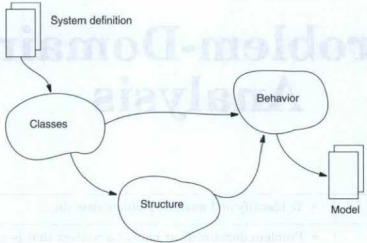
The task, then, is to inquire into the problem domain and the users' understanding of it. In this process, you need not worry about existing systems, nor think about technical problems with storage and data transfer from other systems. Your focus should be on the future users' understanding of the problem domain. Once you have a good model, you can use it to design and implement a system that can process, communicate, and present information about the prolblem domain in an appropriate and usable manner. The aim of problem-domain analysis is to develop such a model. To this end, we employ an object-oriented focus on the key concepts that users apply to describe the phenomena they administrate, monitor, or control The description delineates the problem domain in more detail, and emphasizes 
both static and dynamic aspects. To create a useful model, we must consider the second principle: 
**Principle:** Get an overview first, then supply details.
As you model the problem domain, it is important to bring in as many possibilities, alternatives, and concrete circumstances as possible. However, you should test and evaluate all suggestions critically so that you include only the necessary elements. Your model should be at a reasonably high level of abstraction. The goal is to quickly build a model that briefly and precisely 
gives a r elevant overview.  
Problem-domain analysis is clivided into three activities, as Figure II.1 shows. First, you select the objects, classes, and events that will be the elements of the problem-domain model. Next, you build the model by focusing on structural relations between the selected classes and objects. This represents a movement from the object to the model level. Finally, you focus on the objects' dynamic properties, representing a movement back to the object level. 
In this way, our problem-domain analysis involves a movement from the parts to the whole and back to the parts again. This is the opposite of a top-down method, where you start with the whole and then continuously break it down into smaller and smaller fragments by describing parts and their properties.
The primary starting point for problem-domain analysis is a system definition. The "objects" element of the system definition provides the basic criterion for selecting objects, classes, and events.

### Classes

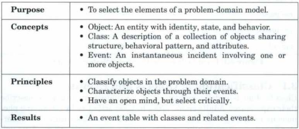
To model the problem domain, we start with the class activity and its fundamental question: Which objects and events should we include in the model and which should we leave out?  
This is figured out by studying the problem domain and talking with users to gain insight into how they understand it. Through this process, it is determined which phenomena are important in the concrete context of the project. The system definition helps us do this. 
Abstraction, classification, and selection are the primary tasks in the class activity. We abstract problem-domain phenomena by seeing them as objects and events. We then classify objects and events, and select which classes and events the system will maintain information on. Classes are the 
first means to define and limit a problem domain. We characterize each class by a specific set of events.
The class activity produces an event table (see Figure 3.1). The horizontal dimension contains the selected classes. The vertical dimension contains the selected events.

#### Classification of Objects and Events

**Principle:** *Classify objects in the problem domain.*
During analysis, and especially in problem-domain modeling, the classification challenges become manifest. One challenge relates to tr aditions for using problem-domain concepts. We can, for example, be forced to further formalize existing concepts. An educational center might use the concept 
"course" to loosely describe several different things. When developing a system for education management, we must create more precise rules for what a course is-as opposed to, say, a seminar because we'll need to unambiguously couple these concepts to specific types of exams and resource-allocation rules.  
Another challenge is tied to how different users interpret shared concepts. In a manufacturing business, people in accounting, production, and sales do not necessarily understand an "order" concept in the same way, even though they use the same term. In some cases, we solve this problem by defining a single concept. In other cases, we must model the problem domain to permit different descriptions of the same phenomenon.  
The aim in system development is to change the user organization by improving its products and services. Therefore, we should not just model the problem domain "as is." When developing an education management system, we should not simply model h ow the users plan and conduct exams. Instead, we should describe how the process will ideally be administered once the system is deployed.  
Creating good classifications is a challenge for all analysis methods. What distinguish the methods are their classification concepts and principles. In OOA&D, we use the concepts object and event to understand phenomena in the problem domain. What we see when we look at the problem domain are objects and events; not processes, entities, or anything else.

##### Object

The object concept is the focus of the class activity. In Chapter 1, we defined this concept generally as:  

**Object:** *An entity with identity, state, and behavior.*

During problem-domain analysis, an object is an abstraction of a phenomenon in that problem domain. Figure 3.2 shows different examples of tangible objects in a problem domain: a customer, a clerk, and a contract. An object can, however, be less tangible, such as an organization or a resource.  
The key point is that we can identify and delimit the object as an independent entity. Figure 3.2 also illustrates an event: two partners agree on a contract. We can use such events to describe an important occurrence in the life of the involved objects. This way of using events is emphasized by the  following principle:

**Principle:** *Characterize objects through their events.*

**What is an object?**
We define an object as an entity with identity, state, and behavior. But what does this really mean in problem-domain analysis? 
**Entity** 
To call something an object, we must be able to describe it as an entity. With physically tangible objects, this is usually not a problem, but as objects become less tangible, they often become harder to define as clearly delineated entities. For example, it's easier to consider a person an entity than an organization
  

**Identity** An object's identity is the property that separates it from all other objects. By definition, all objects must have an identity, so we must define each object in a way that lets us distinguish it from all other objects in the problem domain. For example, in a sand pile, it is impossible to model individual grains of sand as objects because we cannot identify a particular grain as a separate entity from all the other grains. 
  

**State** 
An object's state consists of both its static properties and the dynamic or static values we assign to these properties. For example, static properties of a bank customer object are name, social security number, and the right to make transactions on certain accounts. For a specific customer object, these 
properties will have corresponding values that can be either static or dynamic. The customer's name can have the value "Jane Smith" and this value can change dynamically, even though we are still talking about the same customer. The customer's social security number, on the other hand, is a property that 
typically has a static value. Finally, we represent the customer's right to make transactions as connections between the customer object and the relevant account objects. This set of connections changes when the customer opens or closes an account.     
**Behavior** An object's behavior is the sequence of events that it actively performs and passively expenences during its lifetime. For example, a bank customer's behavior is the specific sequence of opening 
and closing accounts and making transactions that the customer has performed since entering the bank for the first time. 

##### Event

Events specify the qualities of problem-domain objects. We generally define an event as: 
**Event:** *An instantaneous incident involving one or more object*
An event is an abstraction of a problem-domain activity or process that is performed or experienced by one or more objects. When events are the main characteristics of objects, which events we introduce is critically important. For example, we might define a customer as an object that performs account transactions. In doing so, we characterize customer behavior iin a way that ignores the plethora of other events a customer might engage in, such as applying for loans or buying bonds. If we want to also manage these activities, we must introduce them as events that the customer can perform.   

  
When you generate class candidates, take as your departure point knowledge related to the specific problem domain. When this source of inspiration is exhausted, you can use other kinds of knowledge. One approach is to examine similar computerized systems. 
It is often fruitful to take advantage of developers' experiences with similar systems in the same area or field. For example, different inventory systems contain uniform mechanisms and base their models on similar concepts. It can also be both economical and creative to avail yourself of more general knowledge, such as (in this case), warehouse management.

If you are developing a system for monitoring traffic, it is a good idea to read local and international traffic regulations. Likewise, if you are developing a telecommunications system, you should read international telecommunication organizations' standards. The process of writing down many candidates and then evaluating them later might seem like an awful waste of time. However, if you evaluate candidates immediately, the tendency is to reject relevant candidates too soon. In addition, in the early stage, you're missing the overall picture that emerges as your list becomes more complete. By writing all the candidates down and deferring discussion until the list is complete, you'll be more open and creative. 
The classes you select will become the core of your problem-domain model. Thus, you should name your candidate classes carefully.  
• are simple and readable  
• originate in the problem domain  
• indicate a single instance.  
Figure 3.4 shows a sample list of class candidates from an analysis of a Hair Salon System. Some of the candidates represent tangible objects and are quite obvious; others are more abstract.  

 

**Find Events**
Event selection defines the second set of building blocks for your problem domain model. We base this process on the same fundamental technique as class selection.  
However, there is a fundamental difference between events and classes. Numerous verbs relate to the way users carry out their jobs. Such verbs do not belong to the problem domain, but rather to the application domain. 
In the process of producing event candidates, it is a good idea to look at similar computerized systems. Carefully analyzing events that other systems model can inspire new ways of thinlcing. Using technical literature, rules, laws, and standards will also give you a better basis for ensuring sustainability of your problem-domain model. When you are generating event candidates, names should be:  
• are simple and readable 
• originate in the problem domain  
• indicate a single event 
Event names, are ordinarily either: present tense, past tense, and present participle. Figure 3.5 shows a sample list   
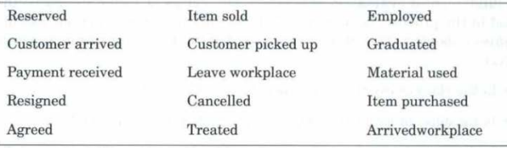

#### Evaluate Systematically 
When we have completed the lists for class and event candidates, we evaluate them systematically using general and specific evaluation criteria. As part of this evaluation, we relate classes and events to each other to produce an event table, which is the outcome of the class activity. 

**General Evaluation Criteria**
A class or event should be included in the problem-domain model if and only if system functions use information about it. This rule is the basis for the following two evaluation criteria:   
• Is the class or event within the system definition?  
• Is the class or event relevant for the problem-domain model? 

Every object and event should be registered in the system. The system definition expresses this need by describing the key problem-domain objects. It also contains an overall specification of the system's functionality. Thus, you can use the system definition to determine what the system functions should produce information about, and thereby what the system should register. In this way, the system definition forms an important basis for evaluating class and event candidates.

**Evaluation Criteria for Classes**
As a rule, when you evaluate a class, you should be able to answer these questions affirmatively:  
• Can you identify objects from the class?  
• Does the class contain unique information?  
• Does the class encompass multiple objects?  
• Does the class have a suitable and manageable number of events?  
You should always be able to unambiguously identify objects from a class. For example, you might identify objects using a reference, such as a number. If you can't identify objects in some way, you may need to redefine your class. 

Up to this point, we describe classes only by their name. However, this brevity can cause problems for the development team. First, developers may agree on a class name, but later disagree on class properties as development activities lead to more detailed descriptions. Second, you might begin with a detailed class concept, but forget some of these details later in the process. To avoid these problems, you can extend the class activity by specifying responsibilities for each class.
  

Cohesion is a classical measure for class-definition quality. A highly cohesive class is a logical unit, and it is this quality that we want to achieve. 
With a cohesive class, it is easy to express the purpose of the class and to 
determine whether it reflects a powerful abstraction. In terms of responsibility, a class with only a few, clear responsibilities will be characterized by 
high cohesion. If, on the other hand, you have a class with a long list of responsibilities, it will have low cohesion and you should probably split it into 
several new classes with higher cohesion. 

**Evaluation Criteria for Events**
Finally, we've developed evaluation criteria that pertains specifically to events. Again, when evaluating your event candidates, you should be able to answer affirmatively:  
• Is the event instantaneous?  
• Is the event atomic?  
• Can the event be identified when it happens? 
In a Conference Planning System, we have a review event, this is understood as something instantaneous, even though it might take several days. The important thing to remember here is that you don't want to monitor or administrate the actual reviewing process, but rather to know when the review is finished and what the result is.   
An event is always atomic and cannot be broken down into sub-events. If you want to model sub-events, you should include each of them instead of the overall event.  
Each event should be identifiable when it happens. In a Conference Planning System, we have an event that represents that an article is sent to a reviewer. Instead of this event, we could have one that represents when the reviewer received the article, but because this would be difficult to observe, the "sent" event is more practical.  
Figure 3.7 shows considerations about event selection for a Hair Salon System.    

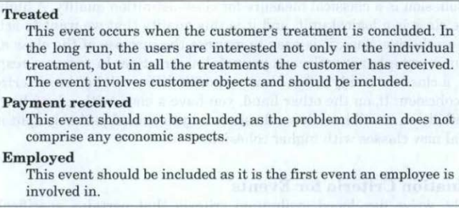

**Relating Classes and Events**
As part of systematically evaJuating and selecting class and event candidates, we describe the relations between them. When we select a class, we also define the events that the class' objects are involved in.  
Similarly, when we select an event, we define the objects that are involved in this event. The general questions we ask are:  
Which events is this class involved in?   
Which classes are involved in this event?  
We summarize the answers in an event table, as Figure 3.1 shows.    

You can also use the event table to evaluate the quality of your class and event candidates. A class with many events will have many check 
marks in its column. This might indicate tha t the class has too many responsibilities and thus low cohesion. Similarly, an event can be common to many classes, indicated by many checks in its row. This indicates that the event connects many mutually related classes that might be highly coupled. Thus, although the event table is the class activity's result, it is also an effective means for evaluating your selection of classes and events. 

OOA&D, pages 385-392 (until the sub-section on Structure)

## Lecture three

OOA&D, chapter 4
OOA&D, chapter 20, pages 392-394 (the sub-sections on Structures and Clusters)

## Lecture four

OOA&D, chapter 5
OOA&D, chapter 19, pages 351-360
OOA&D, chapter 20, pages 394-396

### Behavioral Pattern and Attributes

An object is an entity with identity, state, and behavior. In the class activity, we see behavior simply as the unordered set of events that involve an object. In the behavior activity, we describe behavior more precisely by adding the relative timing of events. An object's behavior is defined by an event 
trace that exhibits a certain ordering of events over time:   
 ***Event trace:*** A sequence of events inuoluing a specific object.

An event trace is unique for a specific object; it is the precise event sequence 
that the object is involved in during a time interval. For example, an object 
of the class "Customer" in the figure below might have the following event trace 
during its lifetime:

account opened - amount deposited - amount withdrawn -
amount deposited - account closed

The focus in object-oriented problem-domain analysis is on objects, but for practical reasons, we describe groups of objects by common class definitions. Accordingly, we refrain from describing the behavior of every object in the problem domain. Instead, we describe a behavioral pattern for object classes:   
 ***Behavioral pattern:*** A description of possible event traces for all objects in a class.

The above figure defines such a behavioral pattern. It expresses that an object from the class "Customer" is created when the customer opens an account in the bank. The customer can then deposit and withdraw money. The customer object ends its life when the account is closed.   
The behavioral pattern describes behavior common to all objects of the class. To produce the pattern, we use examples of event traces for individual objects in the class:    
***Principle:*** Create behavioral patterns from event traces.

### Behaviour activities

###

### Event traces

## Lecture Five - Usage

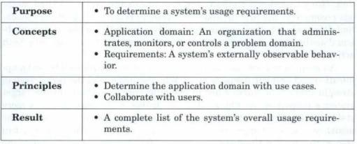

Application-domain analysis focuses on a question: How will the target system be used? The purpose in asking it is to define requirements for the system's functions and interfaces. Application-domain analysis interacts with problem-domain analysis, which we discussed in Lecture Two. There, the question was: What is the target system about? The purpose of problem-domain analysis was to define requfrements for the system's model, which provides our vocabulary for defining the function and interface requirements. 
In most projects, deciding the order of these two main activities is a strategic question. If you begin by analyzing the application domain, your focus is on th e users' work, and you might specify many detailed requirements. From this, you can abstract the underlying concepts, which you can then model as classes, events, and structures in the problem-domain model. If you begin by analyzing the problem domain, your focus will be on what the business is really about, rather than on interfaces and functions.

To be usable, a system must fit the application domain. In this lecture we look at how we can determine this fit. We do this by describing actors and use cases based on an understanding of application-domain activities. The use cases provide an overview of the system requirements from the users' perspective and provide a foundation for defining and evaluating the more basic function and interface requirements.

Although starting with application-domain analysis is easier, starting with problem-domain analysis can yield a better object-oriented description. Many traditional methods and use-case-driven object-oriented methods recommend the first approach; some recommend that you let your situation determine whether to start your analysis with the application or problem domain. On some projects, you can even combine them, pursuing both activities in parallel.

Why distinguish between application and problem domains at all. Why not just model the target system straight away? The answer lies in the difference in stability of the target 
system's properties. As the following figure shows illustrates, a system's model is more stable; its functions and interfaces, more transient. When you change the model, you must change the functions and interfaces. However, you can change functions without changing the model (though you must change the interfaces) and you can change the interface, such as switching from text to graphics, without changing the functions or the model. In short, function and interface requirements change more often, while the system model 
rarely changes. Focusing on the different domains lets you design a more robust and flexible architecture.

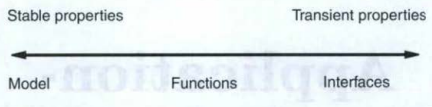

Requirements determination is based on two fundamental principles. 
The first principle is:
**Principle:** *Determine the application domain with use cases.*
Use cases offer an elegant solution to the classic problem in application-domain analysis: focusing on users' work yields too much information in too much detail. Use cases help concentrate the analysis on the interaction between users and the target system.

The second principle is: 
**Principle:** *Collaborate with users.*
Specifying requirements is not a one-way street. Users may not understand the technical options well enough to simply write down the optimal requirements. Cooperation between developers and users is needed. The requirements for usage, functions, and interfaces must be evaluated. You also need 
to reduce the uncertainty inherent in requirements definition. Because requirement formulations are abstract, it is difficult to know whether everything has been considered. To validate requirements, you should conduct experiments in cooperation with users.
Defining requirements is an iterative activity alternating between usage, 
functions, and interfaces. However, for pedagogical reasons, in requirements analysis we focus on each activity in turn, as the following figure shows.

The goal is to create a coherent and consistent result. The following figure gives an overview of the activities in application-domain analysis. 
In the next section, "Usage", we discuss how you can determine target-system use in the application domain by identifying and structuring actors and use cases. 

### Usage

#### Use Cases

Analyzing an existing application domain can create a huge amount of detailed information that has little value to the development process. For efficiency, you must maintain a relevant level of abstraction and focus on the interaction between users and the system. Use cases can help you achieve a relevant focus and abstraction level. In this activity ti;he key concepts are:

**Actor:** *An abstraction of users or other systems that interact with the target system.* 
**Use case:** *A pattern for interaction between the system and actors in the application domain.*

Actors are an abstraction of people and other systems that activate a target system's functions. Of course, in a use-case description, we should indicate 
whether the actor is mechanical or human. A specific person or system can appear in different roJes. 
A use case is an abstraction of an interaction with the target system. It determines a delimited use of a part of the system. A use case can be initiated by an actor or by the target system. The complete set of use cases determines all uses of the target system within the application domain. The main principle in determining system usage is:

**Principle:** *Determine the application domain with use cases.*

Determining use cases is a multi-faceted activity. First, it demands cooperation between users and developers: users formulate needs and contribute 
application-domain insights, and developers formulate use cases and contribute technical knowledge.

Second, determining use cases is an analytical as well as a creative activity. Use cases originate from needs and conditions in the application domain, but a use case is itself an expression of a solution. 
Third, determining use cases is both a descriptive and experimental activity. You cannot fully evaluate the target system's use by sitting at a desk 
studying use cases. A truly critical evaluation must include the user. Some users can be both critical and constructive with a description of the use cases. However, in order to really involve the user, you must present use cases through prototypes. This is a central principle:
**Principle:** *Evaluate use cases in collaboration with users.*

Fourth, use cases define both the target system and its application domain. 
Changes to a company's computerized systems affect the company's organization and way of working. It is important to evaluate these changes in order to avoid negative side effects. (OOAD&D does not cover this) At a minimum, you should evaluate the target system's effect on the organizational context, as expressed in the following principle:
**Principle:** *Assess social changes in the application domain.*

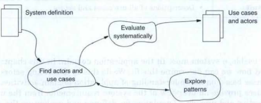
The above figure offers a summary of usage analysis activities: Actors and usecases are defined, often using patterns as inspiration. The activity results 
in a description of all use cases and actors. These descriptions should be systematically evaluated.

#### 6.2 Example: An Automated Payment System

A basic automated payment system has four actors: account owners, who use the system for payment and cash withdrawals; creditors, who have customers that pay via the 
system; administrators, who work with the system; and lquidity monitors, who use the system to monitor the bank's liquidity.
An actor table, as shown in the figure below, provides an overview of the interaction. 
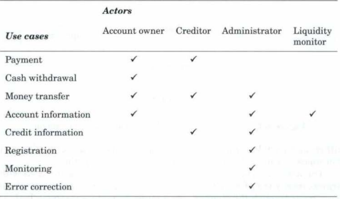

The figure below shows the same information graphically in a use-case diagram. You can illustrate the relation between actors and use cases using either an actor table or a use-case diagram. Most prefer the actor table, as it consumes less space (it's probably less confusing too); UML recommends the use-case diagram.
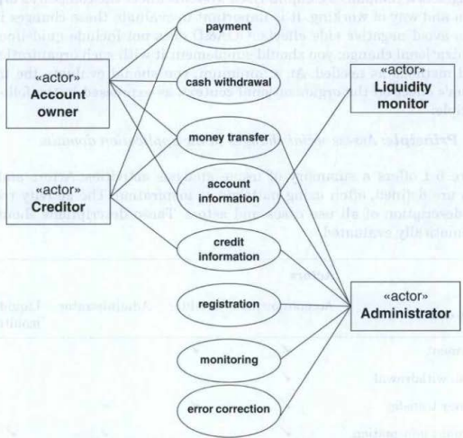

The account owner is involved in four use cases: payment, cash withdrawal, money transfer, and account information. Credit card payments always occur through the creditor-an interactive process involving both actors. Cash withdrawals occur at publicly accessible ATM machines, which are robust and easy to use. Transfers of money to the account can occur either electronically or by check. Although account information is sent by mail to the account owner on a monthly basis, the owner can also call the 
administrator to receive special account information.

The creditor participates in three use cases: payment, money transfer, and credit information. The payments should occur without trouble so that it does not distract the customer and delay the service. The system therefore offers different technical possibilities. The credit card can be read directly by a cash register. Alternatively, the cash register can be fitted with a removable, portable card reader with a keyboard. This card reader is especially used by creditors in places such as restaurants, where the payment does not necessarily occur at a cash register. Transferring money from the system to the creditor occurs electronically or by check. Credit information is given with variable speed and frequency. The creditor can therefore choose between an advanced cash register, which is directly linked to the system; indirect transfer of credit information in electronic form; or sending 
account balances through conventional mail.

Administrators participate in six use cases: registration, monitoring, error correction, money transfer, account information, and credit information. The account owner and the cr editor should be able to contact an administrator with all types of needs, and in principle, the inctividual administrator should perform all tasks related to the payment system. It is important that an administrator has a system overview and is able to switch quickly and efficiently between the system's different functions.

Liquidity monitors participate in only one use case: account information. A liquidity monitor compares information about all the accounts to see 
if the liquidity rules are being followed. A liquidity monitor activates the system to obtain information about the accounts in the payment system; in 
our example, the monitor is another computerized system with access to accounts.

The payment system illustrates the important differences and variations in actors and use cases. Account owners, creditors, administrators, 
and liquidity monitors all use the system in different ways and situations. 
The requirements as to what should be accessible and in what form this access should take place vary widely and must be thoroughly analyzed and 
defined. You may not notice great differences or variations in some systems, but they are there nonetheless. You must understand these differences to design a system that is well adapted to the technical and organizational context

#### Actors and Classes, Use Cases, and Events - A side note

An actor table looks similar to the event table discussed in Chapter 3. This raises the question: Is there any difference between actors with use cases and classes with events? The answer is yes. The main difference is that the phenomena occur in different domains.
A class describes something that the target system should manage, such as a customer. An actor describes someone or something that interacts physically with the system, such as a clerk. An event describes an incident the system must be aware of, such as when a customer orders certain goods. A use case describes the interaction between an actor and the system, such as a clerk entering an order.
An event is something we want the system to remember. A use case is a way of using the system, such as to enter information. The event can occur at a different time and place than the related use case. For example, the ordering could happen in a store and the related use case could be performed later on in a back office.

Of course, there are similarities between actor tables and event tables. They both view their domains- the application domain 
and problem domain, respectively-in static and dynamic aspects. Actors and classes describe static aspects, while use cases and events describe dynamic aspects. Events are structured into behavioral patterns. Similarly, use cases can be viewed as another type of behavioral pattern, albeit in another domain.
We can imagine cases in which the application domain and the problem domain overlap. If a customer enters an order over the Web, then "Customer" is both a class and an actor, and "ordering" is both a use case and the event that occurs when the order is accepted. Thus, the denotation of the concepts can overlap, but the descriptions of actors and classes, and use cases and events, will differ.

#### Find Actors and Use Cases

The central questions about the target system's usage are: Who will use the system? How will it be used? You can answer these questions in terms of actors and uses cases.

#### Identify Actors

To identify actors, you must determine the division oflabor and the task-related roles in the target system's context. 
In the payment system, the four actors are easy to identify because their reasons for using the system are very different. The account owner, the creditor, and the administrator reflect three different organizational roles. 
It might be possible to further specialize these roles. For example, can the account owners be divided into different types? The answer depends on the business policy. In this case, a simple system is preferred. 
We separate the liquidity monitor from the administrator, because the liquidity monitor can be another system, whereas the administrator is always a person. 
The criterion for determining different actors is the dissimilarity of roles, as expressed by the use cases in which actors are involved. This corresponds to the criterion for having two different classes in the problem domain: their objects' behavioral patterns differ.

#### Describe Actors

We describe the target system's actors in actor specifications, as shown in the below figure. An actor specification consists of three parts: goal, characteristics, and examples. The goal describes-as precisely as possible-the actor's role in relation to the target system. The characteristics describe important aspects of actors' use of the system. When the actor is another system, the characteristics could include the technical interface. The general characteristics can be supplemented with concrete examples.
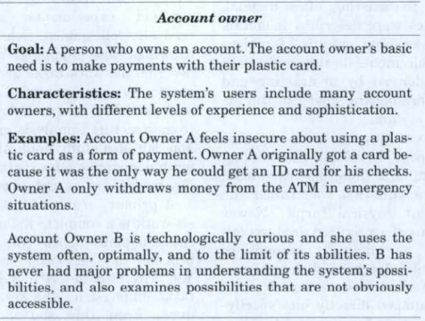

#### Describe Use Cases

The use cases are abstractions of the interactions between the system and the actors. Here, it is vital that you choose suitable abstractions. In the payment system's actor table and use-case diagrams, we named a total of eight use cases: payment, cash withdrawal, money transfer, registration, monitoring, error correction, account information, and credit information. Each of these use cases defines a limited interaction between one or more actors in the target system. We delimit a use case based on the specific actors' viewpoint and application-domain tasks. The goal is to collect the many possible ways of using the target system in a few well-chosen use cases. Taken together, your use cases should give an overview; individually they should be abstractions that are both logical and meaningful to the involved actors.
You can produce a list of possible use cases by examining the application domain's tasks. To determine whether or not the use cases are actually distinct, you must describe them in greater detail. Because use cases are dynamic phenomena, you can descibe them using statechart diagrams or text specifications.

You can produce a list of possible use cases by examining the application domain's tasks. To determine whether or not the use cases are actually distinct, you must describe them in greater detail. Because use cases are dynamic phenomena, you can desc1·ibe them using statechart diagrams or text specifications.

A statechart diagram defines the different states of the interaction and the different ways the system or actor can change that state. Figure 6.5 shows an example of a statechart diagram, and Figure 6.6 shows a specification of the same use case. In a use-case specification, the use case itself is briefly but precisely described in a structured text that focuses on the actors. As a supplement, you can also describe the relevant system objects and functions.

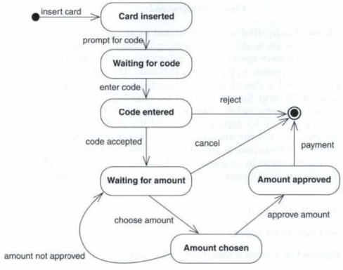

OOA&D, Part III
OOA&D, Chapter 6
OOA&D, Chapter 19 (pages 362 - 364)

## Lecture Six - Functions

Functions focus on what the system can do to assist actors in their work. When determining requirements for the functions, we ask the following question: What is the system going to do? In the usage activity, our question focused more on how the system would be used. Given that it is difficult to analyze "what" without analyzing "how," the usage and function activities are closely connected.

### System Functions

From an analytical point of view, the elegance of functions is that they express, in a simple way, the intent of a system. More precisely, we define a function as follows.

**Function:** *A facility for making a model useful for actors.*

A function is activated, executed, and provides a result. Function execution can change a model component's state or create a reaction in the application or problem domains. A function is a requirement; it is an abstract property of the system. Functions are realized through program operaions

### Function Types

As an aid to our analysis, we will discuss different types of functions. Each function type expresses a relation between the model and the system's context and has characteristics that help us when we define functions. We have identified four types of functions:

*Update* functions are activated by a problem-domain event and result in a change in the model's state.

*Signal* functions are activated by a change in the model's state and result in a reaction in the context; this reaction might be a display to the actors in the application domain, or a direct intervention in the problem domain.

*Read* functions are activated by a need for information in an actor's work task and result in the system displaying relevant parts of the model.

*Compute* functions are activated by a need for information in an actor's work task and consist of a computation involving information provided by the actor or the model; the result is a display of the computation's result.

A system's specific functions are rarely "pure"; they seldom fit perfectly into one of the four types. Functions are mixtures. The primary function in an air traffic control system will involve update, signal, read, and compute. 
However, it is still useful to categorize the functions. To do so increases our understanding of their
character, and lets us use the function types as tools in our application-domain analysis.

* An example of a signal is a function that continuously follows the traffic situation and gives an alarm in a critical situation.

### Analyzing Functions

The purpose of this activity is to determine the system's information processing capabilities by constructing a complete list of functions, as well as a detailed specification of the complex parts. Describing functions is not particularly difficult; the greater challenge is to choose which functions to include.

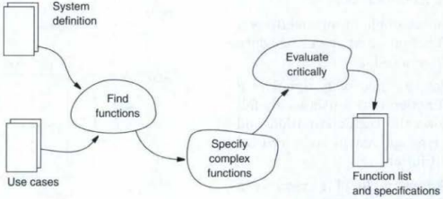

The central criterion for system-functionality analysis is that analysis ends with a list of functions that is both complete and consistent with the use cases. This is expressed in the following principle:

**Principle:** *Identify all functions.*

For some functions, you must describe their content in detail to understand what they do. However, you should give detailed descriptions for only the most complex and incomprehensible functions. The second principle for the function-analysis activity is:

**Principle:** *Specify only complex functions.*

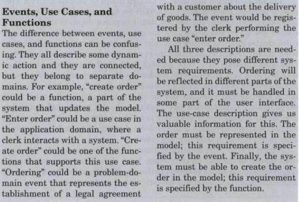

**Principle:** *Check consistency with use cases and the model*

Function analysis consists of three subactivities: find functions, specify 
complex functions, and evaluate critically. The relations between subactivities, preconditions, and results are shown in the first figure of this lecure.

### Find functions

When finding the functions, there are two essential aspects that you should keep in mind. First, consider the sources for identifying functions. Where do the system's function requirements come from? Second, consider the level of detail. How detailed should you be in function descriptions? How general or specific should you be in defining individual functions? The sources for identifying functions are partly the problem-domain description, as expressed by its classes and events, and partly the application-domain description, as expressed by its use cases. Classes typically give rise to read and update functions. Events lead to requirements for update functions. Use cases give rise to all types of functions.

You must describe functions in enough detail to provide both an overview of the total functionality and a basis for agreement between users and developers. Given this, the level of detail required depends on the experience of the users and developers. Inexperienced developers and users require greater detail to ensure that they share an understanding of the functions.

Functions specified at a very general level yield uncertainty. Functions specified at a very specific level render the analysis inefficient. For example, describing read and update functions for all attributes is too much detail. A function like "calculate pay for all employees," is, on the other hand, too general. "Calculate basic pay," "calculate health insurance," and "calculate tax," is typically an appropriate level of detail for users and developers familiar with the application and problem domains.

A good way to start identifying functions is to systematically ask questions related to the four function types. Each of the four function types give rise to several questions that lead to the required functions. We will now examine the analytical questions for each of the function types.
---------------------------------

**Questions for each event** 
---------------------------------

* **How is the event observed, and how is it registered? In which 
use cases does this happen?**

* **How should the use cases be supported by update functions?**
 
* **Which objects, attributes, and object structures are affected 
by the event, and what requirements does this impose on the 
update functions?**

---------------------------------

Update functions are connected to events. The fact that an event is included in the model expresses that it is sufficiently important to warrant registration in the system. Each event triggers a state update for model objects that are involved in the event.

Read functions are related to information needs expressed in use cases, but they are also related to the model's content. The fact that a class with events, attributes, and structures has been defined often reflects a direct need for information in the application domain. The following figure shows the relevant questions for uncovering information needs
---------------------------------

**Questions about infomation needs**
---------------------------------

* Given the work of the actors, what do the actors need to know 
about the st.ate of the model? What read functions does this 
give rise to? 
* Given the model, which objects and structures will the actors 
need information about? What read functions does this give 
rise to?

---------------------------------

Compute functions are related to more complex information needs that cannot be immediately met by reading the model. Compute functions must be identified from the use cases. An important question is how to delimit the individual compute function. Again, the use cases hold the answer. A computational sequence that cannot be interrupted by the actor should be 
supported by one function. If the computational sequence consists of several alternative parts, you must consider using more than one function. On the other hand, you should avoid cluttering the list of functions with insignificant variations in the computations of a basic function. The following figure shows the questions for analyzing compute functions. 
---------------------------------

**Questions about needs for computation**
---------------------------------

* Which computations (not necessarily based on the model) do 
the actors need to have carried out? 
* Does the computational basis come from the actors, the 
model, or both? 
* Which computations form complete wholes in the use cases?

---------------------------------

The result of the function-analysis activity is a list of functional requirements for the system. The list must be complete and express the collective needs of customers and actors and meet the application-domain's demands for computer support. The following figure shows an example of a list of functions for the Hair Salon System. At the top is the total functionality as described in the system definition; we then list the name, complexity, and type of each individual function. 
Complexity is an assessment of how complicated it will be to develop the function. In this case, we used a simple four-point scale with the values simple, medium, complex, and very complex. Assessing function complexity is a part of customer negotiations and offers an estimate of the development effort ahead. You can also use these assessments later, during development, as a basis for negotiations about changes to system requirements.
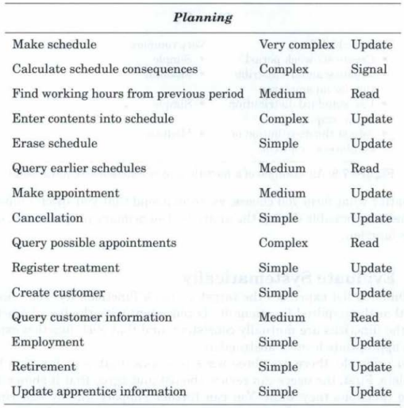

### Specify Complex Functions

The basic rule is that you should describe functions briefly and informally in a list. Detailed specifications are for special cases. You can construct a detailed specifications in several ways.

* A mathematical expression where the relation between input data and output data is specified as o = f(i) 
* An algorithm, which is typically sketched in a simple structured language with a few, simple control structures (also called pseudo code). 

* A further functional partitioning of a function in the function list, showing the complete functional hierarchy directly in the list, as the following figure shows. A hierarchical function list often gives a better overview than an equivalent data-flow description.
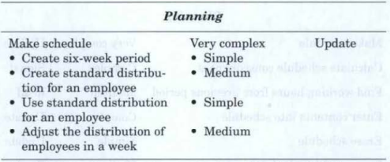

No matter what form you choose, it is recommended that you specify functions 
as briefly as possible during the analysis. The primary purpose is to identify the function

### Evaluate Systematically

In principle, there are three ways to ensure that your function list is complete. First, the users can review the list and agree that it shows exactly the functions they want. You can further support this by experiments with the users and function prototypes, or by comparing the functions and use cases.

Second, for each function type, you can ensure the possibilities are exhausted by returning to the questions in Section 7 .2, and using them to review your function list.

Third, you can compare the function list with the system definition and the model.

The general definition of the system functionality in the system definition should be in accordance with your final list of functions. If the system definition says it is a payroll system, then no invoicing functions should be included. Differences between the general definition and the list of functions may give rise to a revision of both the system definition and the functions. 
Finally, you must compare the function list with the model. The model must include precisely that information about the objects that the functions need; no more, no less. That is, if the model contains objects, structures, or events that are never used by any of the functions, then either the model contains too much or some functions are missing.

OOA&D, Chapter 7.

## Lecture Seven -

OOA&D, Chapter 15

Other things to read (background), (find them on the source indicated):
Lauesen, S. and Vinter, O. (2001) Preventing Requirement Defects: An Experiment in Process Improvement. Requirements Eng. 6:37–50.
https://link-springer-com.zorac.aub.aau.dk/article/10.1007/PL00010355

Dahlbom, B. and Mathiassen, L. (1993) Computers in Context: The Philosophy and Practice of Systems Design, Chapter 4 and 5. Blackwell Publishers.
Can be borrowed through the library (AUB)

Wirth, N. (1971) Program Development by Stepwise Refinement. Communications of the ACM 14(4):221-227.
https://dl-acm-org.zorac.aub.aau.dk/ft_gateway.cfm?id=362577&ftid=43866&dwn=1&#URLTOKEN#

Naur, P. (1972) An experiment on program development. BIT 12:347-365.
https://link-springer-com.zorac.aub.aau.dk/content/pdf/10.1007%2FBF01932307.pdf

Mathiassen, L. and Stage, J. (1992) The Principle of Limited Reduction in Software Design. Information Technology & People 6(2-3):171-185.
https://www-emeraldinsight-com.zorac.aub.aau.dk/doi/pdfplus/10.1108/EUM0000000003550

## Lecture Eight - Architectural Design, Criteria and Components

OOA&D, Part IV
OOA&D, Chapter 9
OOA&D, Chapter 10
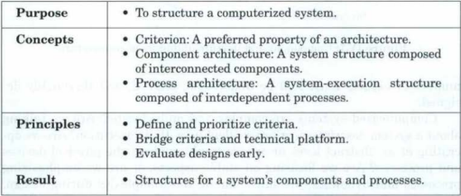

A vague and unclear architecture 
will result in a lot of wasted work. Architectural design is often considered an all or nothing question. Either you build the system from scratch, in which case all the architectural issues must be addressed; or you adapt the system to an existing architecture, in which case many arch itectural decisions have already been made. 
The former situation is unusual; systems are rarely constructed from scratch. But, even if you are adapting the system to an existing architecture, you should be acquainted with the conditions that the architecture defines for the design activity. Even when much is already given, a surprising number of aspects must still be understood, studied, and thoroughly designed

Computerized systems are complex and multi-faceted: Are we talking about a system description, or are we dealing with its execution? Are we operating at an abstract level, or are we thinking about the physical devices and processes? Are we focusing on stable aspects, or are we emphasizing processes and dynamics? We must handle this complexity during design. Here, we offer two different and partially overlapping viewpoints. When combined, they provide a good understanding of architectural design

The following figure illustrates the architecture concepts. The component architecture focuses on classes (the stable aspects). It structures the system in related components, and is concerned mainly with logical considerations. 
The component architecture decomposes the system into identifiable, mutually related components. The process architecture focuses on objects (the dynamic aspects).
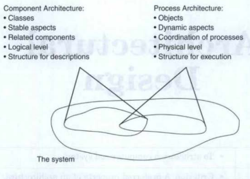

## Lecture Nine

OOA&D, Part V
OOA&D, Chapter 12.

## Lecture Ten

OOA&D, chapter 13.

## Lecture eleven

OOA&D, chapter 14.