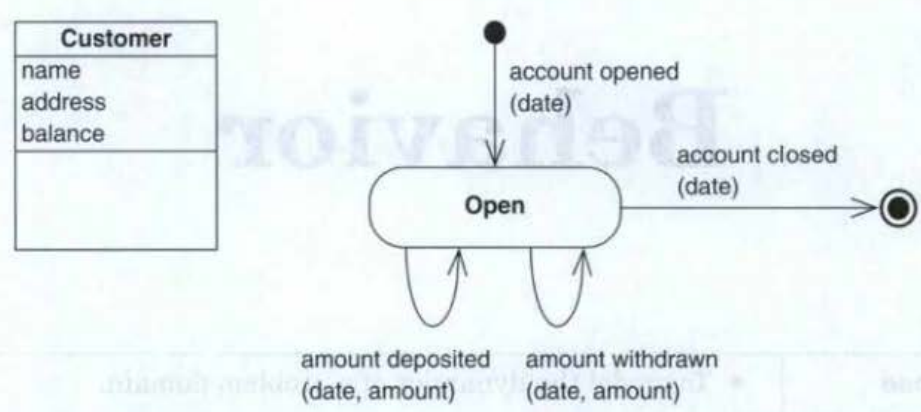

# Systems Development/System Analysis and Design

## Lecture one

### FACTOR

The factor criterion consists of six elements:  
Functionality: The system functions that support the application-do-main tasks.  
Application domain: Those parts of an organization that administrate, monitor, or control a problem domain.   
Conditions: The conditions under which the system will be developed and used.   
Technology: Both the technology used to develop the system and the technology on which the system will run.  
Objects: The main onbjets in the problem domain.   
Responsibility: The system's overall responsibility in relation to its context.

The FACTOR criterion can be used in two ways. You can use it to support system-definition development, carefully considering how each of the six elements should be formulated.  Or you can start your definition by describing the system and then use the criteria to see how the system definition satisfies each of the six factors. "In principle either starting point works"

## Lecture two

## Lecture three

## Lecture four

### Behavioral Pattern and Attributes

An object is an entity with identity, state, and behavior. In the class activity, we see behavior simply as the unordered set of events that involve an object. In the behavior activity, we describe behavior more precisely by adding the relative timing of events. An object's behavior is defined by an event 
trace that exhibits a certain ordering of events over time:   
 ***Event trace:*** A sequence of events inuoluing a specific object.

An event trace is unique for a specific object; it is the precise event sequence 
that the object is involved in during a time interval. For example, an object 
of the class "Customer" in the figure below might have the following event trace 
during its lifetime:

account opened - amount deposited - amount withdrawn -
amount deposited - account closed

The focus in object-oriented problem-domain analysis is on objects, but for practical reasons, we describe groups of objects by common class definitions. Accordingly, we refrain from describing the behavior of every object in the problem domain. Instead, we describe a behavioral pattern for object classes:   
 ***Behavioral pattern:*** A description of possible event traces for all objects in a class.

The above figure defines such a behavioral pattern. It expresses that an object from the class "Customer" is created when the customer opens an account in the bank. The customer can then deposit and withdraw money. The customer object ends its life when the account is closed.   
The behavioral pattern describes behavior common to all objects of the class. To produce the pattern, we use examples of event traces for individual objects in the class:    
***Principle:*** Create behavioral patterns from event traces.
### Behaviour activities

###

### Event traces